# ClaudeControl Architecture Diagram

```mermaid
graph TD
    subgraph "Entry Points"
        CLI[cli.py<br/>Command-line interface]
        MENU[interactive_menu.py<br/>Interactive menu system]
        API[Python API<br/>Direct imports]
    end
    
    subgraph "Core Engine"
        SESSION[Session/core.py<br/>Process control & management]
        REGISTRY[Global Registry<br/>Session persistence]
        CONFIG[Config Loader<meaningful/>.claude-control/config.json]
    end
    
    subgraph "Investigation Framework"
        INVESTIGATOR[investigate.py/ProgramInvestigator<br/>Automatic program exploration]
        REPORT[InvestigationReport<br/>Findings documentation]
        STATE[ProgramState<br/>State mapping]
    end
    
    subgraph "Testing Framework"
        BLACKBOX[testing.py/BlackBoxTester<br/>Comprehensive CLI testing]
        TESTRUNNER[Test Suites<br/>Startup/Help/Fuzz/Resource tests]
    end
    
    subgraph "Helper Functions"
        HELPERS[claude_helpers.py<br/>High-level convenience functions]
        CMDCHAIN[CommandChain<br/>Sequential command execution]
        PARALLEL[parallel_commands<br/>Concurrent execution]
        MONITOR[watch_process<br/>Process monitoring]
    end
    
    subgraph "Pattern Matching"
        PATTERNS[patterns.py<br/>Text extraction & classification]
        PROMPTS[COMMON_PROMPTS<br/>Prompt detection patterns]
        ERRORS[COMMON_ERRORS<br/>Error detection patterns]
        FORMATS[Data Format Detection<br/>JSON/XML/CSV/Table]
    end
    
    subgraph "Low-Level Infrastructure"
        PEXPECT[pexpect<br/>Process spawning & control]
        EXCEPTIONS[exceptions.py<br/>Custom error types]
        PSUTIL[psutil<br/>Process management]
    end
    
    subgraph "Data Storage"
        SESSIONS[(~/.claude-control/sessions/<br/>Session logs & state)]
        CONFIGS[(~/.claude-control/programs/<br/>Saved configurations)]
        INVESTIGATIONS[(~/.claude-control/investigations/<br/>Investigation reports)]
        PIPES[(/tmp/claudecontrol/*.pipe<br/>Named pipes for streaming)]
    end
    
    subgraph "External Processes"
        TARGET[Target CLI Program<br/>Program being controlled]
        SSH[SSH Sessions<br/>Remote programs]
    end

    %% Entry point connections
    CLI -->|creates| SESSION
    CLI -->|calls| HELPERS
    CLI -->|initiates| INVESTIGATOR
    CLI -->|runs| BLACKBOX
    MENU -->|orchestrates| CLI
    API -->|direct access| SESSION
    API -->|direct access| HELPERS
    API -->|direct access| INVESTIGATOR
    API -->|direct access| BLACKBOX

    %% Core engine flow
    SESSION -->|spawns process| PEXPECT
    SESSION -->|registers| REGISTRY
    SESSION -->|loads| CONFIG
    SESSION -->|writes logs| SESSIONS
    SESSION -->|creates pipes| PIPES
    SESSION -->|controls| TARGET
    REGISTRY -->|persists| SESSIONS
    CONFIG -->|configures| SESSION

    %% Investigation flow
    INVESTIGATOR -->|uses| SESSION
    INVESTIGATOR -->|analyzes with| PATTERNS
    INVESTIGATOR -->|creates| STATE
    INVESTIGATOR -->|generates| REPORT
    INVESTIGATOR -->|probes| TARGET
    REPORT -->|saves to| INVESTIGATIONS
    STATE -->|tracks transitions| TARGET

    %% Testing flow
    BLACKBOX -->|creates| SESSION
    BLACKBOX -->|tests| TARGET
    BLACKBOX -->|uses| PATTERNS
    BLACKBOX -->|monitors with| PSUTIL
    TESTRUNNER -->|executes in| BLACKBOX

    %% Helper interactions
    HELPERS -->|wraps| SESSION
    HELPERS -->|uses| PATTERNS
    HELPERS -->|implements| CMDCHAIN
    HELPERS -->|implements| PARALLEL
    HELPERS -->|implements| MONITOR
    CMDCHAIN -->|sequential| SESSION
    PARALLEL -->|concurrent| SESSION
    MONITOR -->|watches| SESSION
    HELPERS -->|ssh via| SSH

    %% Pattern matching flow
    PATTERNS -->|detects prompts| PROMPTS
    PATTERNS -->|detects errors| ERRORS
    PATTERNS -->|classifies| FORMATS
    SESSION -->|uses patterns| PATTERNS
    INVESTIGATOR -->|uses patterns| PATTERNS
    BLACKBOX -->|uses patterns| PATTERNS

    %% Infrastructure
    PEXPECT -->|spawns| TARGET
    PEXPECT -->|connects| SSH
    SESSION -->|throws| EXCEPTIONS
    BLACKBOX -->|uses| PSUTIL
    PSUTIL -->|monitors| TARGET

    %% Data persistence
    SESSION -->|saves config| CONFIGS
    SESSION -->|loads config| CONFIGS
    PIPES -->|streams from| TARGET

    %% Styling
    classDef entryPoint fill:#e1f5fe,stroke:#01579b,stroke-width:2px
    classDef core fill:#fff3e0,stroke:#e65100,stroke-width:2px
    classDef framework fill:#f3e5f5,stroke:#4a148c,stroke-width:2px
    classDef helper fill:#e8f5e9,stroke:#1b5e20,stroke-width:2px
    classDef pattern fill:#fce4ec,stroke:#880e4f,stroke-width:2px
    classDef infra fill:#f5f5f5,stroke:#424242,stroke-width:2px
    classDef storage fill:#fff8e1,stroke:#f57f17,stroke-width:2px
    classDef external fill:#e0f2f1,stroke:#004d40,stroke-width:2px

    class CLI,MENU,API entryPoint
    class SESSION,REGISTRY,CONFIG core
    class INVESTIGATOR,REPORT,STATE,BLACKBOX,TESTRUNNER framework
    class HELPERS,CMDCHAIN,PARALLEL,MONITOR helper
    class PATTERNS,PROMPTS,ERRORS,FORMATS pattern
    class PEXPECT,EXCEPTIONS,PSUTIL infra
    class SESSIONS,CONFIGS,INVESTIGATIONS,PIPES storage
    class TARGET,SSH external
```

## Component Descriptions

### Entry Points
- **cli.py**: Command-line interface with subcommands (run, investigate, probe, test, etc.)
- **interactive_menu.py**: User-friendly menu-driven interface for guided interaction
- **Python API**: Direct import and use of modules in Python scripts

### Core Engine
- **Session (core.py)**: Main class managing process lifecycle, I/O, and state
- **Global Registry**: In-memory session storage for persistence across calls
- **Config Loader**: Loads settings from ~/.claude-control/config.json

### Investigation Framework
- **ProgramInvestigator**: Automatically explores CLI programs to discover commands and behavior
- **InvestigationReport**: Structured findings including commands, states, prompts, and patterns
- **ProgramState**: Tracks different program states and transitions between them

### Testing Framework
- **BlackBoxTester**: Comprehensive testing without source code access
- **Test Suites**: Startup, help system, invalid input, exit behavior, resources, concurrency, fuzzing

### Helper Functions
- **claude_helpers.py**: High-level functions like test_command, probe_interface, investigation_summary
- **CommandChain**: Sequential command execution with conditions
- **parallel_commands**: Run multiple commands concurrently
- **watch_process**: Monitor processes for specific patterns

### Pattern Matching
- **patterns.py**: Core pattern detection and text extraction
- **COMMON_PROMPTS**: Pre-defined patterns for various shell prompts
- **COMMON_ERRORS**: Pre-defined error message patterns
- **Data Format Detection**: Identifies JSON, XML, CSV, tables in output

### Infrastructure
- **pexpect**: External library for process spawning and PTY control
- **exceptions.py**: Custom exceptions (SessionError, TimeoutError, ProcessError)
- **psutil**: External library for process monitoring and management

### Data Flow
1. **Discovery Flow**: CLI/API → ProgramInvestigator → Session → Target Program → Patterns → Report
2. **Testing Flow**: CLI/API → BlackBoxTester → Multiple Sessions → Target Program → Test Results
3. **Automation Flow**: CLI/API → Helpers/Session → Target Program → Output/State
4. **Persistence Flow**: Session ↔ Registry ↔ File System (logs, configs, reports)

### Key Interactions
- Sessions can be reused via the Global Registry
- All high-level operations go through Session class
- Pattern matching is used by all major components
- Named pipes enable real-time streaming
- Configuration affects all session creation