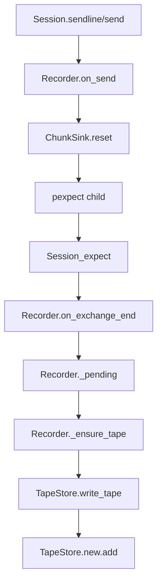
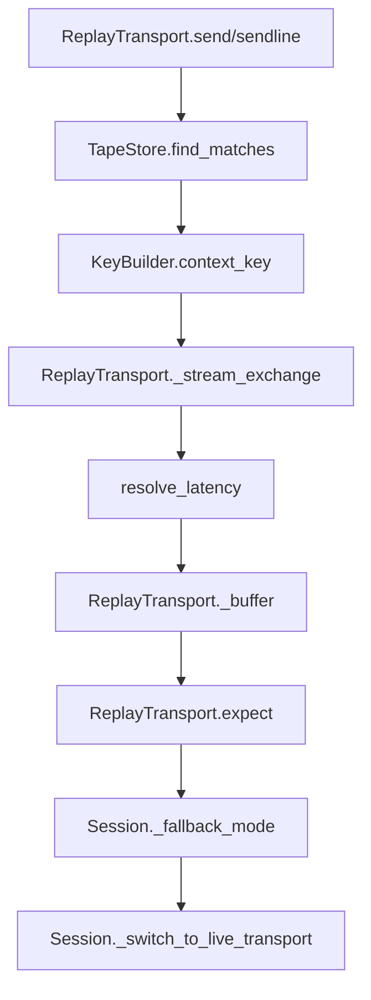
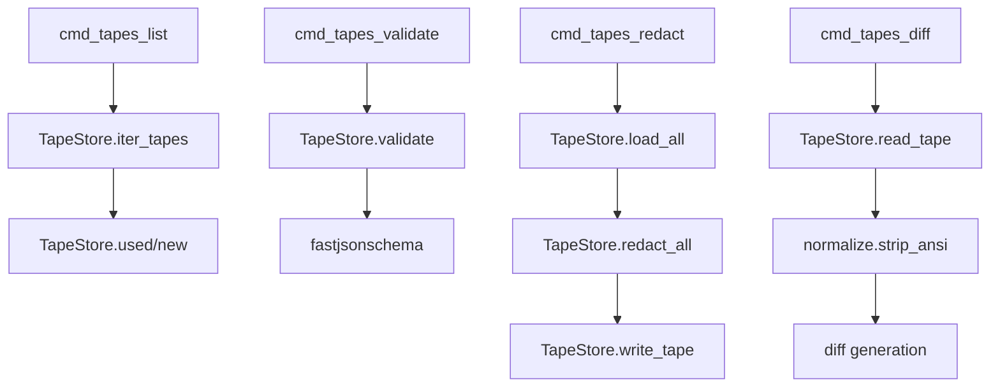
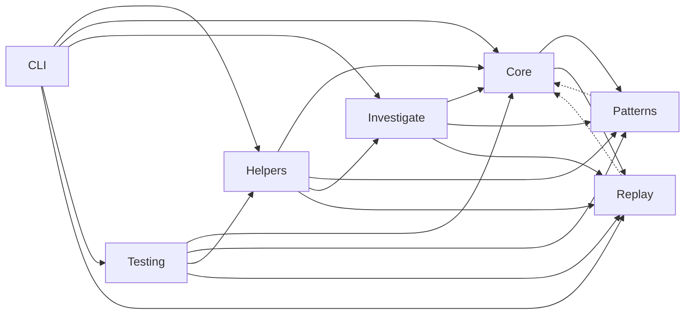

# ClaudeControl Call Graph Documentation

## Entry Points and Call Chains

### CLI Command Entry Points

```mermaid
graph TD
    subgraph AutomationAnalysis ["Automation & Analysis"]
        CLI_run[ccontrol run<br/>cmd_run]
        CLI_investigate[ccontrol investigate<br/>cmd_investigate]
        CLI_test[ccontrol test<br/>cmd_test]
        CLI_probe[ccontrol probe<br/>cmd_probe]
        CLI_fuzz[ccontrol fuzz<br/>cmd_fuzz]
        CLI_menu[ccontrol<br/>interactive_menu]
    end

    subgraph ReplayCommands ["Replay-Oriented Commands"]
        CLI_rec[ccontrol rec<br/>cmd_rec]
        CLI_play[ccontrol play<br/>cmd_play]
        CLI_proxy[ccontrol proxy<br/>cmd_proxy]
        CLI_tapes_list[ccontrol tapes list<br/>cmd_tapes_list]
        CLI_tapes_validate[ccontrol tapes validate<br/>cmd_tapes_validate]
        CLI_tapes_redact[ccontrol tapes redact<br/>cmd_tapes_redact]
        CLI_tapes_diff[ccontrol tapes diff<br/>cmd_tapes_diff]
    end

    subgraph CoreControlLayer ["Core Control Layer"]
        control[control<br/>get/create session]
        Session_init[Session.__init__]
        init_transport[Session._initialize_transport]
        setup_live[Session._setup_live_transport]
        setup_replay[Session._setup_replay_transport]
        spawn[pexpect.spawn]
        recorder_start[Recorder.start]
        replay_transport[ReplayTransport]
        tape_store[TapeStore]
        key_builder[KeyBuilder]
        summary[print_summary]
        registry[SESSION_REGISTRY.add]
    end

    CLI_run --> control
    CLI_investigate --> investigate
    CLI_test --> black_box_test
    CLI_probe --> probe_commands
    CLI_fuzz --> run_fuzz_test
    CLI_menu --> control
    CLI_menu --> investigate
    CLI_menu --> black_box_test

    CLI_rec --> run_replay[_run_replay_command]
    CLI_play --> run_replay
    CLI_proxy --> run_replay
    run_replay --> Session_init
    run_replay --> Session_close[Session.close]

    CLI_tapes_list --> cmd_tapes_list
    CLI_tapes_validate --> cmd_tapes_validate
    CLI_tapes_redact --> cmd_tapes_redact
    CLI_tapes_diff --> cmd_tapes_diff

    control --> Session_init
    Session_init --> init_transport
    init_transport --> setup_live
    init_transport --> setup_replay

    setup_live --> spawn
    setup_live --> recorder_start
    setup_live --> registry

    setup_replay --> tape_store
    setup_replay --> key_builder
    setup_replay --> replay_transport

    Session_close --> summary
```



### Python API Entry Points

```mermaid
graph TD
    subgraph HighLevelAPI ["High-Level API"]
        API_run[run<br/>one-liner]
        API_control[control<br/>persistent session]
        API_investigate[investigate_program]
        API_test[test_command]
        API_parallel[parallel_commands]
        API_recorder[Recorder]
        API_player[Player]
        API_tapestore[TapeStore]
    end

    subgraph SessionManagement ["Session Management"]
        Session_new[Session.__init__]
        Session_expect[Session.expect]
        Session_send[Session.send/sendline]
        Session_close[Session.close]
        find_session[find_session]
        register[register_session]
        summary[print_summary]
    end

    subgraph ReplayIntegration ["Replay Integration"]
        key_builder[KeyBuilder]
        recorder_on_send[Recorder.on_send]
        recorder_on_end[Recorder.on_exchange_end]
        replay_send[ReplayTransport.send]
        replay_expect[ReplayTransport.expect]
        tape_index[TapeStore.build_index]
        find_matches[TapeStore.find_matches]
    end

    subgraph PatternMatching ["Pattern Matching"]
        wait_for_prompt[wait_for_prompt]
        detect_patterns[detect_prompt_pattern]
        classify[classify_output]
        extract_json[extract_json]
    end

    subgraph ProcessLayer ["Process Layer"]
        spawn_process[pexpect.spawn]
        read_output[read_nonblocking]
        write_input[process.send]
        kill_process[process.terminate]
    end

    API_run --> Session_new
    API_run --> Session_expect
    API_run --> Session_close

    API_control --> find_session
    find_session -->|not found| Session_new
    find_session -->|found| Session_expect
    Session_new --> register

    Session_new --> key_builder
    Session_new --> tape_index

    Session_expect --> read_output
    Session_expect --> wait_for_prompt
    wait_for_prompt --> detect_patterns

    Session_send --> write_input

    API_recorder --> recorder_on_send
    API_recorder --> recorder_on_end
    API_player --> replay_send
    API_player --> replay_expect
    API_tapestore --> tape_index
    tape_index --> find_matches

    Session_close --> kill_process
    Session_close --> summary

    API_parallel --> ThreadPoolExecutor
    ThreadPoolExecutor --> API_run
```



### Core Session Lifecycle

```mermaid
graph TD
    subgraph SessionCreation ["Session Creation"]
        control_func[control()]
        find[find_session]
        new[Session.__init__]
        init_transport[Session._initialize_transport]
        live_setup[Session._setup_live_transport]
        replay_setup[Session._setup_replay_transport]
        spawn[pexpect.spawn]
        recorder_start[Recorder.start]
        tapestore_load[TapeStore.load_all]
        tapestore_index[TapeStore.build_index]
        register[register_session]
    end

    subgraph SessionOperations ["Session Operations"]
        expect[Session.expect/expect_exact]
        send[Session.send/sendline]
        replay_send[ReplayTransport.send/sendline]
        replay_expect[ReplayTransport.expect]
        recorder_on_send[Recorder.on_send]
        recorder_on_end[Recorder.on_exchange_end]
        drain[Session._drain_output]
        check[Session.is_alive]
    end

    subgraph SessionCleanup ["Session Cleanup"]
        close[Session.close]
        terminate[process.terminate/close]
        cleanup[cleanup_resources]
        unregister[unregister_session]
        summary[print_summary]
    end

    control_func --> find
    find -->|miss| new
    new --> init_transport
    init_transport --> live_setup
    init_transport --> replay_setup

    live_setup --> spawn
    live_setup --> recorder_start
    live_setup --> register

    replay_setup --> tapestore_load
    replay_setup --> tapestore_index
    replay_setup --> register

    send --> recorder_on_send
    expect --> recorder_on_end
    send --> check
    expect --> drain
    replay_send --> replay_expect

    close --> terminate
    close --> summary
    terminate --> cleanup
    cleanup --> unregister
```

### Recording Exchange Flow



### Replay Exchange Flow



### Tape Management Commands



## Call Frequency and Performance

### High-Traffic Paths

| Function | Called By | Frequency | Performance Impact |
|----------|-----------|-----------|-------------------|
| `Session.expect()` | Live automation and replay | Every interaction | Critical – blocks until pattern |
| `ReplayTransport.expect()` | Replay sessions | Every prompt wait | Critical – replays buffered output |
| `TapeStore.find_matches()` | ReplayTransport | Once per input | Medium – key lookup and matcher checks |
| `Recorder.on_send()` | Recording sessions | Every outbound input | Medium – allocates IOInput and resets ChunkSink |
| `Recorder.on_exchange_end()` | Recording sessions | After each expect | Medium – JSON assembly & pending queue |
| `Session.is_alive()` | Session operations | Before live operations | Low – process poll |
| `read_nonblocking()` | Expect loops & draining | Continuous during wait | Medium – I/O bound |
| `SESSION_REGISTRY.get()` | `control` with reuse | Every reuse request | Low – dict lookup |
| `detect_prompt_pattern()` | Investigation | Per output chunk | Medium – regex matching |
| `classify_output()` | Investigation/Testing | Per command response | Medium – multiple patterns |

### Performance-Critical Paths

#### Session Creation Path

```
control(command, reuse=True)  [~10ms if reused, ~120ms if new]
  └── SESSION_REGISTRY.get()  [<1ms]
      └── Session.is_alive()  [~1ms]
          └── process.poll()  [<1ms]
  OR
  └── Session.__init__()  [~60-120ms]
      ├── TapeStore.load_all()  [up to 200ms per 1k tapes]
      ├── TapeStore.build_index()  [~10ms per tape]
      ├── Recorder.start()  [<1ms]
      └── pexpect.spawn()  [~45ms when live]
```

#### Replay Matching Path

```
ReplayTransport.send(payload)  [0-10ms]
  └── TapeStore.find_matches()  [~2ms per key]
      ├── KeyBuilder.context_key()  [<1ms]
      └── Command/STDIN matchers  [<1ms]
  └── ReplayTransport._stream_exchange()  [latency + chunk decode]
      └── resolve_latency()  [<1ms]
          └── time.sleep()  [latency-dependent]
```

#### Recording Path

```
Recorder.on_send(raw, kind)  [<1ms]
  └── ChunkSink.reset()
Recorder.on_exchange_end(ctx)  [1-5ms]
  ├── ChunkSink.to_output()
  ├── OutputDecorator (optional)
  ├── Tape assembly (JSON5 ready)
  └── TapeStore.write_tape()  [5-15ms with disk flush]
```

#### Investigation Path

```
investigate_program(program)  [5-60 seconds]
  └── ProgramInvestigator.__init__()  [~100ms]
      └── Session.__init__()  [~120ms with replay setup]
  └── discover_interface()  [5-60s]
      └── probe_commands()  [~1s per command]
          └── Session.sendline()  [<1ms]
          └── Session.expect()  [0-timeout]
      └── map_states()  [~2s per state]
          └── detect_state_transition()  [~10ms]
```

## Recursive and Complex Patterns

### State Exploration (Recursive)

```python
def explore_state(state_name, depth=0):
    """Recursively explore program states"""
    if depth >= MAX_DEPTH:  # Base case
        return

    for command in get_commands(state_name):
        new_state = send_and_detect(command)
        if new_state and new_state not in visited:
            explore_state(new_state, depth + 1)  # Recursive call
```

### Command Chain Execution

```python
CommandChain.run()
  └── for each command:
      └── check_condition(previous_results)
          └── Session.sendline(command)
              └── Session.expect(pattern)
                  └── store_result()
                      └── continue or break
```

### Parallel Execution Pattern

```python
parallel_commands(commands)
  └── ThreadPoolExecutor(max_workers=10)
      └── for each command (parallel):
          └── run(command)
              └── Session.__init__()
              └── Session.expect()
              └── Session.close()
      └── gather_results()
```

### Replay Fallback Pattern

```python
def send_with_fallback(session, payload):
    try:
        session.process.send(payload)
    except TapeMissError:
        if session._fallback_mode is FallbackMode.PROXY:
            session._switch_to_live()
            session.send(payload.decode(session.encoding))
        else:
            raise
```

## Cross-Module Dependencies

### Module Interaction Matrix

| Caller → | core | patterns | investigate | testing | helpers | cli | replay |
|----------|------|----------|-------------|---------|---------|-----|--------|
| **core** | - | ✓ | - | - | - | - | ✓ |
| **patterns** | Weak | - | - | - | - | - | Weak |
| **investigate** | ✓ | ✓ | - | - | - | - | ✓ |
| **testing** | ✓ | ✓ | ✓ | - | ✓ | - | ✓ |
| **helpers** | ✓ | ✓ | ✓ | - | - | - | ✓ |
| **cli** | ✓ | - | ✓ | ✓ | ✓ | - | ✓ |
| **replay** | ✓ | - | - | - | - | ✓ | - |

✓ = Direct function calls between modules
Weak = Optional/conditional usage

### Dependency Flow



## Critical Function Dependencies

### Most Depended Upon Functions

1. **`Session.__init__`**
   - Called by: All entry points, including replay subcommands
   - Critical for: Transport selection, recorder/player setup
   - Change impact: **Very High**
   - Dependencies: pexpect, TapeStore, KeyBuilder, Recorder, ReplayTransport

2. **`Session.expect` / `Session.expect_exact`**
   - Called by: All automation code and replay
   - Critical for: Pattern matching, exchange segmentation
   - Change impact: **Very High**
   - Dependencies: patterns module, Recorder, ReplayTransport

3. **`ReplayTransport.send` / `ReplayTransport.expect`**
   - Called by: Replay sessions and CLI `play`/`rec`/`proxy`
   - Critical for: Deterministic playback and prompt resolution
   - Change impact: **High**
   - Dependencies: TapeStore, KeyBuilder, latency/error policies

4. **`Recorder.on_send` / `Recorder.on_exchange_end`**
   - Called by: Recording sessions (`rec`, live automation with record enabled)
   - Critical for: Capturing exchanges and writing tapes
   - Change impact: **High**
   - Dependencies: ChunkSink, TapeStore, decorators, redaction

5. **`TapeStore.find_matches`**
   - Called by: Replay transport matching logic
   - Critical for: Locating exchanges under normalization rules
   - Change impact: **High**
   - Dependencies: KeyBuilder, matchers, normalization, JSON5 parsing

6. **`control`**
   - Called by: All high-level functions
   - Critical for: Session management and reuse
   - Change impact: **High**
   - Dependencies: SESSION_REGISTRY, Session

7. **`detect_prompt_pattern`**
   - Called by: Investigation and recorder prompt detection
   - Critical for: Interface discovery and exchange boundaries
   - Change impact: **Medium**
   - Dependencies: COMMON_PROMPTS, regex

8. **`classify_output`**
   - Called by: Investigation, testing, replay summaries
   - Critical for: Output analysis and heuristics
   - Change impact: **Medium**
   - Dependencies: Pattern library

9. **`TapeStore.write_tape`**
   - Called by: Recorder, CLI redact/diff workflows (in-place mode)
   - Critical for: Atomic persistence of JSON5 tapes
   - Change impact: **Medium**
   - Dependencies: portalocker, pyjson5, filesystem semantics

## Call Chain Examples

### Example 1: Interactive Command with Recording Enabled

```
session = Session("npm test", record=RecordMode.NEW)
  └── Session.__init__("npm test")
      ├── TapeStore.load_all()
      ├── TapeStore.build_index()
      └── Recorder.start()
  └── session.sendline("npm test")
      └── Recorder.on_send(..., "line")
      └── pexpect.spawn.sendline()
  └── session.expect("passing")
      ├── pexpect.spawn.expect()
      └── Recorder.on_exchange_end(...)
          └── TapeStore.write_tape()
  └── session.close()
      └── print_summary(TapeStore)
```

### Example 2: Replay Flow via CLI `ccontrol play`

```
ccontrol play -- python -q
  └── cmd_play(args)
      └── _run_replay_command(record=DISABLED, fallback=args.fallback)
          └── Session.__init__(replay=True)
              └── Session._setup_replay_transport()
                  ├── TapeStore.load_all()
                  ├── TapeStore.build_index()
                  └── ReplayTransport(...)
          └── session.interact()
              └── ReplayTransport.sendline()
                  └── TapeStore.find_matches()
                  └── ReplayTransport.expect()
          └── Session.close()
              └── print_summary(TapeStore)
```

### Example 3: Tape Validation Workflow

```
ccontrol tapes validate --tapes ./tapes --strict
  └── cmd_tapes_validate(args)
      └── TapeStore.validate(strict=True)
          └── fastjsonschema.compile(...)
          └── pyjson5.load(handle)
      └── emit diagnostics to stdout
```

### Example 4: Parallel Testing with Replay Proxy Mode

```
black_box_test("app", replay=True, fallback=FallbackMode.PROXY)
  └── BlackBoxTester("app", replay=True)
      └── control()
          └── Session.__init__(replay=True, fallback=PROXY)
              └── Session._setup_replay_transport()
      └── test_concurrent_sessions()
          └── parallel_commands([...])
              └── Session.sendline()
                  └── ReplayTransport.send(...)
                      └── TapeStore.find_matches()
                  └── TapeMissError -> fallback proxy
                      └── Session._switch_to_live_transport()
                      └── pexpect.spawn()
      └── run_fuzz_test()
          └── Recorder.on_send()/on_exchange_end() if record enabled
```

## Hotspot Analysis

### Functions with Highest Impact if Changed

| Function | Impact | Reason |
|----------|--------|--------|
| `ReplayTransport.send/expect` | Critical | All replayed sessions depend on accurate playback |
| `TapeStore.find_matches` | Critical | Determines whether exchanges are found or proxy fallback fires |
| `TapeStore.write_tape` | Critical | Guarantees atomic, redacted JSON5 persistence |
| `Session.__init__` | Critical | Configures transport, recorder, and indexing |
| `Session.expect` | Critical | Drives exchange completion and recorder flush |
| `SESSION_REGISTRY` | High | Session reuse mechanism |
| `Recorder.on_exchange_end` | High | Controls tape generation and decoration |
| `detect_patterns` | Medium | Investigation accuracy |
| `classify_output` | Medium | Testing/investigation |
| `TimeoutError.__init__` | Low | Error formatting only |

### Performance Bottlenecks

1. **Tape loading/indexing** – first replay session pays the cost of JSON5 parsing and key building.
2. **Pattern Matching in `expect()`** – can block for full timeout.
3. **Replay latency policies** – configured delays add wall-clock time intentionally.
4. **Process Spawning** – ~50-100ms per new live session when falling back to proxy.
5. **State Exploration** – exponential with depth during investigation.
6. **Fuzz Testing** – linear with input count.
7. **Parallel Execution** – limited by thread pool size and tape contention.

## Optimization Opportunities

### Current Bottlenecks
- Cache TapeStore indexes across sessions to avoid rebuilds when using the same configuration.
- `expect()` polls output in a loop – could integrate `select()` or `asyncio` for efficiency.
- Pattern matching done sequentially – consider parallel evaluation for large pattern sets.
- Session creation synchronous – pre-spawn live processes when proxy fallback is likely.
- Investigation single-threaded – parallelize probe commands when safe.

### Caching Opportunities
- Compiled regex patterns (currently cached).
- Session reuse (currently implemented).
- TapeStore index reuse between sessions.
- Investigation reports (currently saved).
- Program configurations (currently saved).

## Summary

The updated call graph highlights how ClaudeControl integrates Talkback-style record & replay with its existing automation stack:

1. **Unified entry layer** – CLI and API routes funnel through `Session`, now capable of live or replay transports.
2. **Replay-aware session lifecycle** – `Session.__init__` orchestrates TapeStore loading, KeyBuilder configuration, Recorder startup, and ReplayTransport creation before any I/O occurs.
3. **Deterministic matching** – Replay flows depend on `TapeStore.find_matches` and matchers/normalizers to locate exchanges, with proxy fallback handing control back to live `pexpect` when needed.
4. **Recording pipeline** – Recorder hooks the existing output capture stream to segment exchanges, apply decorators/redaction, and atomically persist JSON5 tapes.
5. **Tape management tooling** – Dedicated CLI commands operate through TapeStore for listing, validating, redacting, and diffing artifacts.
6. **Exit visibility** – `print_summary` reports new and unused tapes whenever sessions close with summaries enabled.

Critical paths now include TapeStore access, ReplayTransport matching, and Recorder persistence in addition to the longstanding focus on session management, pattern matching, and parallel execution.
