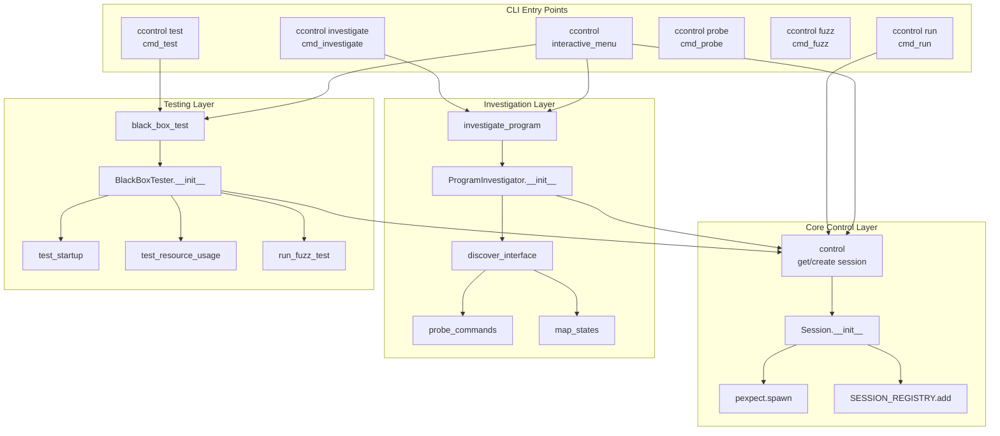
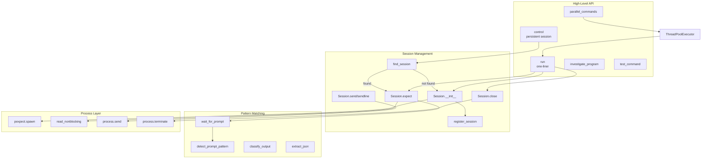
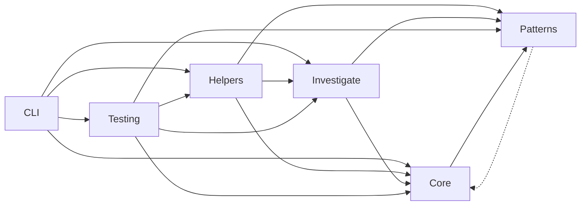

# ClaudeControl Call Graph Documentation

## Entry Points and Call Chains

### CLI Command Entry Points



### Python API Entry Points



### Core Session Lifecycle

```mermaid
graph TD
    subgraph "Session Creation"
        control_func[control()]
        find[find_session]
        new[Session.__init__]
        spawn[pexpect.spawn]
        setup[setup_directories]
        register[register_session]
    end
    
    subgraph "Session Operations"
        expect[expect]
        send[send/sendline]
        read[get_output]
        check[is_alive]
    end
    
    subgraph "Session Cleanup"
        close[close]
        terminate[terminate_process]
        cleanup[cleanup_resources]
        unregister[unregister_session]
    end
    
    control_func --> find
    find -->|miss| new
    new --> spawn
    new --> setup
    new --> register
    
    register --> expect
    register --> send
    
    expect --> read
    send --> check
    
    close --> terminate
    terminate --> cleanup
    cleanup --> unregister
```

## Call Frequency Analysis

### High-Traffic Paths

| Function | Called By | Frequency | Performance Impact |
|----------|-----------|-----------|-------------------|
| `Session.expect()` | All automation | Every interaction | Critical - blocks until pattern |
| `Session.is_alive()` | Session operations | Before every operation | Low - process poll |
| `read_nonblocking()` | expect, monitoring | Continuous during wait | Medium - I/O bound |
| `SESSION_REGISTRY.get()` | control with reuse | Every reuse request | Low - dict lookup |
| `detect_prompt_pattern()` | Investigation | Per output chunk | Medium - regex matching |
| `classify_output()` | Investigation/Testing | Per command response | Medium - multiple patterns |

### Performance-Critical Paths

#### Session Creation Path
```
control(command, reuse=True)  [~10ms if reused, ~100ms if new]
  └── SESSION_REGISTRY.get()  [<1ms]
      └── Session.is_alive()  [~1ms]
          └── process.poll()  [<1ms]
  OR
  └── Session.__init__()  [~50ms]
      └── pexpect.spawn()  [~45ms]
      └── create_directories()  [~5ms]
```

#### Pattern Matching Path
```
Session.expect(patterns, timeout=30)  [0-30000ms]
  └── read_nonblocking()  [~1ms per call]
      └── pattern.search()  [<1ms per pattern]
          └── store_match()  [<1ms]
  OR timeout
      └── TimeoutError with output  [~10ms to format]
```

#### Investigation Path
```
investigate_program(program)  [5-60 seconds]
  └── ProgramInvestigator.__init__()  [~100ms]
      └── Session.__init__()  [~100ms]
  └── discover_interface()  [5-60s]
      └── probe_commands()  [~1s per command]
          └── Session.sendline()  [<1ms]
          └── Session.expect()  [0-timeout]
      └── map_states()  [~2s per state]
          └── detect_state_transition()  [~10ms]
```

## Recursive and Complex Patterns

### State Exploration (Recursive)
```python
def explore_state(state_name, depth=0):
    """Recursively explore program states"""
    if depth >= MAX_DEPTH:  # Base case
        return
    
    for command in get_commands(state_name):
        new_state = send_and_detect(command)
        if new_state and new_state not in visited:
            explore_state(new_state, depth + 1)  # Recursive call
```

### Command Chain Execution
```python
CommandChain.run()
  └── for each command:
      └── check_condition(previous_results)
          └── Session.sendline(command)
              └── Session.expect(pattern)
                  └── store_result()
                      └── continue or break
```

### Parallel Execution Pattern
```python
parallel_commands(commands)
  └── ThreadPoolExecutor(max_workers=10)
      └── for each command (parallel):
          └── run(command)
              └── Session.__init__()
              └── Session.expect()
              └── Session.close()
      └── gather_results()
```

## Cross-Module Dependencies

### Module Interaction Matrix

| Caller → | core | patterns | investigate | testing | helpers | cli |
|----------|------|----------|-------------|---------|---------|-----|
| **core** | - | ✓ | - | - | - | - |
| **patterns** | Weak | - | - | - | - | - |
| **investigate** | ✓ | ✓ | - | - | - | - |
| **testing** | ✓ | ✓ | ✓ | - | ✓ | - |
| **helpers** | ✓ | ✓ | ✓ | - | - | - |
| **cli** | ✓ | - | ✓ | ✓ | ✓ | - |

✓ = Direct function calls between modules
Weak = Optional/conditional usage

### Dependency Flow


## Critical Function Dependencies

### Most Depended Upon Functions

1. **`Session.__init__`**
   - Called by: All entry points
   - Critical for: Process spawning
   - Change impact: **Very High**
   - Dependencies: pexpect, psutil

2. **`Session.expect`**
   - Called by: All automation code
   - Critical for: Pattern matching
   - Change impact: **Very High**
   - Dependencies: patterns module, pexpect

3. **`control`**
   - Called by: All high-level functions
   - Critical for: Session management
   - Change impact: **High**
   - Dependencies: SESSION_REGISTRY, Session

4. **`detect_prompt_pattern`**
   - Called by: Investigation, helpers
   - Critical for: Interface discovery
   - Change impact: **Medium**
   - Dependencies: COMMON_PROMPTS, regex

5. **`classify_output`**
   - Called by: Investigation, testing
   - Critical for: Output analysis
   - Change impact: **Medium**
   - Dependencies: Pattern library

6. **`SESSION_REGISTRY`**
   - Used by: control, cleanup, status
   - Critical for: Session reuse
   - Change impact: **High**
   - Dependencies: threading.Lock

## Call Chain Examples

### Example 1: Interactive Command
```
success, error = test_command("npm test", "passing")
  └── run("npm test", expect="passing")
      └── Session.__init__("npm test")
          └── pexpect.spawn("npm test")
      └── Session.expect("passing")
          └── read_nonblocking()
          └── pattern.search()
      └── Session.get_output()
      └── Session.close()
          └── process.terminate()
```

### Example 2: Investigation Flow
```
investigate_program("mystery_app")
  └── ProgramInvestigator("mystery_app")
      └── Session.__init__("mystery_app")
  └── discover_interface()
      └── detect_prompt_pattern(initial_output)
      └── probe_commands(["help", "?", "--help"])
          └── Session.sendline("help")
          └── Session.expect(prompt, timeout=10)
          └── extract_commands_from_help(output)
      └── map_states(discovered_commands)
          └── explore_state("main", depth=0)
              └── detect_state_transition(output)
  └── generate_report()
      └── save_json(report_path)
```

### Example 3: Parallel Testing
```
black_box_test("app")
  └── BlackBoxTester("app")
  └── test_startup()
      └── Session.__init__("app")
      └── Session.expect(prompt, timeout=5)
  └── test_concurrent_sessions()
      └── parallel_commands(["app"] * 3)
          └── ThreadPoolExecutor.submit(run, "app")
              └── Session.__init__("app")
              └── Session.close()
  └── run_fuzz_test()
      └── fuzz_program("app", max_inputs=50)
          └── generate_fuzz_inputs()
          └── Session.sendline(fuzz_input)
  └── generate_report()
```

## Hotspot Analysis

### Functions with Highest Impact if Changed

| Function | Impact | Reason |
|----------|--------|--------|
| `pexpect.spawn` | Critical | All process control depends on it |
| `Session.__init__` | Critical | Central to all operations |
| `Session.expect` | Critical | Core pattern matching |
| `SESSION_REGISTRY` | High | Session reuse mechanism |
| `control()` | High | Main entry point |
| `detect_patterns` | Medium | Investigation accuracy |
| `classify_output` | Medium | Testing/investigation |
| `TimeoutError.__init__` | Low | Just error formatting |

### Performance Bottlenecks

1. **Pattern Matching in expect()** - Can block for full timeout
2. **Process Spawning** - ~50-100ms per new session
3. **State Exploration** - Exponential with depth
4. **Fuzz Testing** - Linear with input count
5. **Parallel Execution** - Limited by thread pool size

## Optimization Opportunities

### Current Bottlenecks
- `expect()` polls output in a loop - could use select()
- Pattern matching done sequentially - could parallelize
- Session creation synchronous - could pre-spawn
- Investigation single-threaded - could parallelize probes

### Caching Opportunities
- Compiled regex patterns (currently cached)
- Session reuse (currently implemented)
- Investigation reports (currently saved)
- Program configurations (currently saved)

## Summary

The call graph reveals ClaudeControl's architecture:

1. **Clear separation of concerns** - CLI, Core, Investigation, Testing layers
2. **Central Session class** - All operations flow through it
3. **Pattern-based architecture** - Heavy use of pattern matching throughout
4. **Session reuse optimization** - Registry prevents redundant spawning
5. **Parallel execution support** - ThreadPoolExecutor for concurrent operations
6. **Defensive error handling** - Multiple catch points in call chains

Critical paths are:
- Session creation and management
- Pattern matching in expect()
- Investigation's recursive state exploration
- Parallel command execution

The most impactful changes would be to Session class, expect() method, or the SESSION_REGISTRY, as these are used by virtually all functionality.