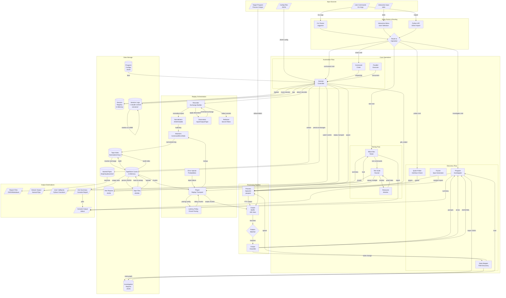
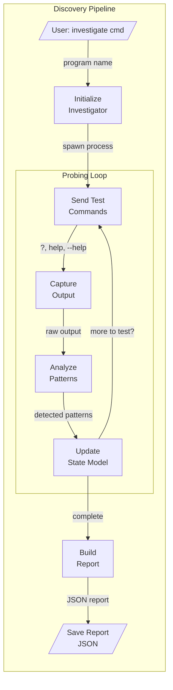
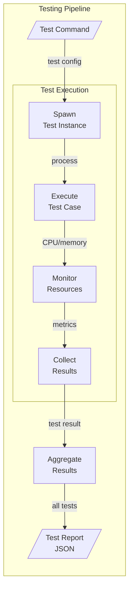
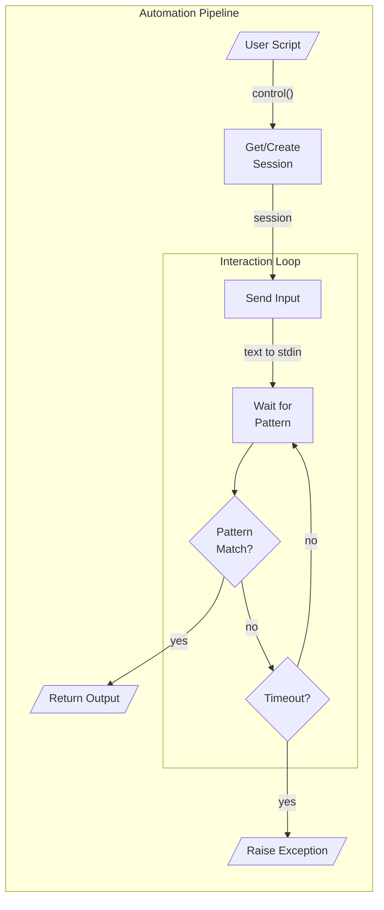
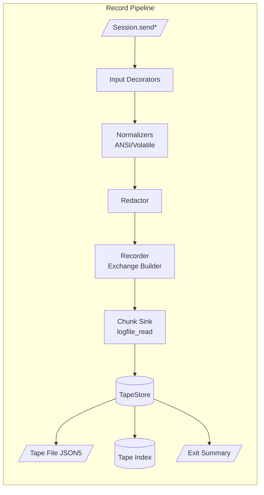
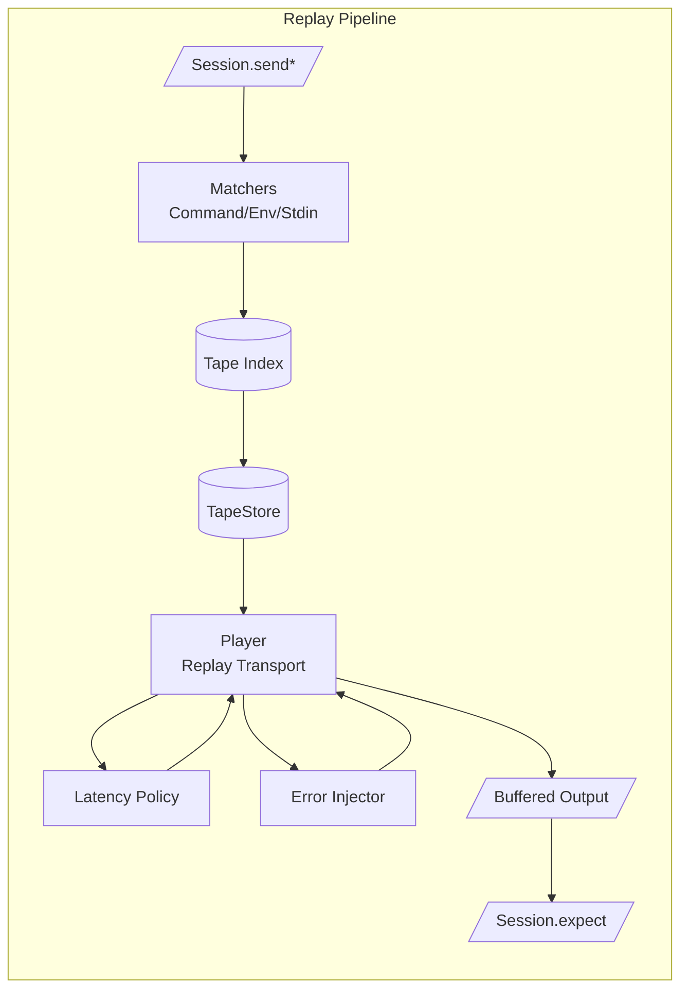
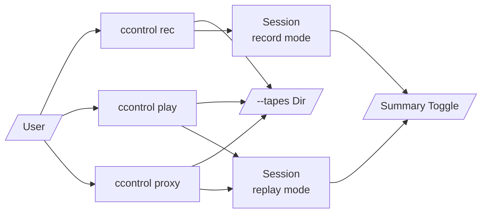
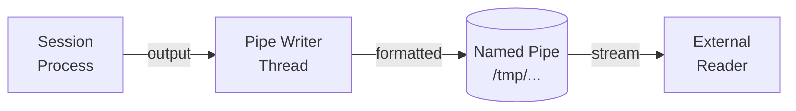

# ClaudeControl Data Flow Diagram

## Main Data Flow Architecture



Record/replay capabilities sit alongside the existing investigation, testing, and automation flows. Recorder hooks capture chunked terminal exchanges into JSON5 tapes with optional normalization, redaction, and decorator pipelines, while the Player rehydrates those tapes via the TapeStore and latency/error policies to satisfy future `Session` interactions without spawning real processes.

## Detailed Data Flow Patterns

### 1. Discovery Data Flow



### 2. Testing Data Flow



### 3. Automation Data Flow



### 4. Record Mode Data Flow



### 5. Replay Data Flow



### 6. Tape Management CLI Flow



## Data Transformations

### Input Transformations
| Stage | Input Format | Output Format | Transformation |
|-------|--------------|---------------|----------------|
| CLI Parsing | Raw argv | Parsed args dict | argparse validation |
| Config Loading | JSON file | Python dict | JSON deserialization + defaults |
| Pattern Compilation | String patterns | Regex objects | re.compile() |
| Command Template | Template string | Formatted command | String interpolation |
| Replay Context Normalization | Session metadata | Normalized key tuple | ANSI stripping + volatile scrub |
| Secret Redaction | Raw bytes | Sanitized bytes | Regex redaction + policy gates |

### Output Transformations
| Stage | Input Format | Output Format | Transformation |
|-------|--------------|---------------|----------------|
| Output Buffering | Byte stream | UTF-8 strings | Decode + line splitting |
| Pattern Extraction | Raw text | Structured data | Regex groups extraction |
| JSON Detection | Mixed text | JSON objects | JSON parsing |
| State Detection | Output + patterns | State name | FSM transition logic |
| Report Generation | Raw findings | Markdown/JSON | Template rendering |
| Tape Chunking | Live stream | Chunk list | Recorder delay capture + base64 |
| Tape Serialization | Tape dataclasses | JSON5 file | pyjson5 dump with pretty print |
| Replay Pacing | Stored chunks | Timed output | Latency policy application |
| Error Injection | Replay stream | Synthetic failure | Probabilistic injector |

### Data Aggregations
| Operation | Input Data | Output Data | Aggregation Method |
|-----------|------------|-------------|-------------------|
| Investigation | Multiple probes | Single report | Merge findings + dedupe |
| Testing | Individual tests | Test suite results | Group by test type |
| Parallel Commands | Multiple outputs | Results dict | Keyed by command |
| Resource Monitoring | Time series data | Statistics | Min/max/avg calculation |
| Tape Index Build | Tape exchanges | Normalized key map | Hash + matcher normalization |
| Summary Accounting | Tape usage flags | Exit summary report | Track new/used via sets |

## Replay Feature Integration

### Modes & Fallback Policies
- **RecordMode**: `NEW` appends fresh exchanges, `OVERWRITE` replaces matches, `DISABLED` skips writes while still enabling playback.
- **FallbackMode**: `NOT_FOUND` surfaces `TapeMissError` for CI-fast failures, `PROXY` launches the real program and optionally records depending on the record mode.
- Modes can be supplied statically or via callables, enabling environment-driven overrides.

### Matching & Normalization Pipeline
- Matcher inputs use normalized `(program, args, env, cwd, prompt, stdin[, state_hash])` tuples.
- Normalizers strip ANSI, collapse whitespace, and scrub volatile tokens (timestamps, IDs) before hashing.
- Allow/ignore lists (`allow_env`, `ignore_env`, `ignore_args`, `ignore_stdin`) prune dynamic context prior to comparison.
- Custom matcher hooks mirror Talkback semantics for parity across transports.

### Decorators, Redaction, and Secret Handling
- Input/output/tape decorators receive a shared context object, enabling tagging, pretty-printing, or metadata enrichment before persistence.
- Redaction runs prior to writes, masking passwords, API keys, and other detector hits unless explicitly disabled via environment flag.
- Tape decorators can adjust latency/error metadata or annotate tape tags prior to JSON5 serialization.

### Latency & Error Injection Controls
- Global and per-tape latency values support constants, ranges, or callables; Player resolves them per chunk to reproduce pacing.
- Error injection policies evaluate probabilities (0-100%) to raise synthetic failures, truncate output, or override exit codes for resilience testing.
- Both features share deterministic RNG seeding to keep replay runs repeatable.

### Tape Lifecycle & Exit Summary
- TapeStore loads all JSON5 tapes at session startup, builds an in-memory index, and tracks `used` vs `new` sets.
- Recorder writes tapes via temp-file + rename to remain crash-safe and marks new files for the exit summary.
- On shutdown, the summary reporter lists new tapes created and any loaded but unused tapes, mirroring Talkback’s UX.

### CLI & Configuration Touchpoints
- `ccontrol rec|play|proxy` map to record, playback, and proxy workflows, inheriting global flags like `--tapes`, `--record`, `--fallback`, `--latency`, and `--error-rate`.
- Library usage flows through `Session(...)` keyword arguments with identical defaults, keeping backwards compatibility when options are omitted.
- Tape management commands (`ccontrol tapes list|validate|redact`) operate on the same tape directory, enabling validation and cleanup tooling.
- User configuration in `~/.claude-control/config.json` gains a `replay` section that seeds defaults without overriding explicit CLI or API parameters.

## Data Volume & Performance

### Typical Data Sizes
- **Session Output Buffer**: 10,000 lines (configurable)
- **Log File Rotation**: 10MB per file
- **Investigation Reports**: 5-50KB JSON
- **Test Reports**: 10-100KB JSON
- **Named Pipe Buffer**: 64KB (OS default)
- **Pattern Cache**: ~100 compiled patterns
- **Tape Files**: 5-200KB JSON5 per tape (chunked exchanges)
- **Tape Index Cache**: ~1-5MB per 1,000 exchanges (normalized keys)

### Processing Times
- **Session Spawn**: 10-100ms
- **Pattern Matching**: <1ms per line
- **Investigation**: 5-60 seconds (depends on program)
- **Black Box Testing**: 10-120 seconds
- **Parallel Commands**: Limited by slowest command
- **Tape Index Build**: ≤200ms per 1,000 exchanges
- **Replay Match**: ≤2ms per exchange lookup
- **Latency Injection**: Adds 0-50ms jitter per chunk by policy

### Bottlenecks
1. **Process Spawning**: PTY allocation can be slow
2. **Pattern Matching**: Complex regex on large outputs
3. **File I/O**: Log rotation during heavy output
4. **Named Pipes**: Reader must keep up with writer
5. **Tape Hydration**: Loading many JSON5 tapes on cold start
6. **Replay Streaming**: High latency or error injection policies delay completion

## Data Consistency

### Transaction Boundaries
- **Session Operations**: Each expect/send is atomic
- **Investigation**: Complete report or rollback
- **Testing**: Each test case is independent
- **Config Save**: Atomic file write with temp file
- **Tape Write**: Recorder writes to temp file then rename for atomicity

### Eventual Consistency Points
- **Session Registry**: In-memory, lost on crash
- **Log Files**: Buffered writes, may lose last lines
- **Named Pipes**: No persistence, real-time only
- **TapeStore Cache**: In-memory index rebuilt on restart

### Data Synchronization
- **Registry Lock**: Thread-safe session access
- **File Locks**: Prevent concurrent config writes
- **Process Groups**: Ensure child cleanup
- **Tape Locks**: portalocker guards overwrites during record mode

## Error Handling Data Flows

### Failed Pattern Match
```
Expect Pattern → Timeout → Capture Recent Output → TimeoutError(output)
```

### Process Death
```
Send Command → SIGCHLD → Check Exit Status → ProcessError(exitcode)
```

### Resource Exhaustion
```
Monitor Resources → Threshold Exceeded → Kill Process → ResourceError
```

### Tape Miss (Replay)
```
Send Input → Normalize Context → Index Lookup → Miss? → TapeMissError | Proxy Live Spawn
```

### Tape Load Failure
```
Read JSON5 → Parse → Schema Validate → SchemaError (exit with diagnostics)
```

### Injected Failure
```
Replay Chunk → should_inject_error? → Inject Exit Code/Exception → Surface to Session
```

### Recovery Mechanisms
- **Session Retry**: Respawn dead sessions
- **Pattern Fallback**: Try alternative patterns
- **Timeout Extension**: Adaptive timeout adjustment
- **Output Truncation**: Prevent memory overflow
- **Tape Proxy Fallback**: Switch to live process when fallback=PROXY
- **Tape Validation CLI**: `ccontrol tapes validate` checks schema issues before replay

## Stream Processing (Named Pipes)

### Real-time Data Flow


Replay mode feeds the same pipe writer through the Player buffer, ensuring recorded chunks and live streams share formatting and timestamp envelopes before reaching external consumers.

### Pipe Data Format
```
[2024-01-10T10:30:45][OUT] Normal output line
[2024-01-10T10:30:46][ERR] Error output line
[2024-01-10T10:30:47][IN] User input sent
[2024-01-10T10:30:48][MTX] Session metadata
```

## Performance Optimizations

### Caching Strategies
- **Compiled Patterns**: Cache regex compilation
- **Session Reuse**: Keep sessions alive across calls
- **Config Cache**: Load configs once per run
- **Output Windows**: Sliding window buffer
- **TapeStore Index**: Precompute normalized keys at startup
- **Summary Sets**: Maintain in-memory `used`/`new` tape trackers

### Batch Processing
- **Parallel Execution**: ThreadPoolExecutor for concurrent commands
- **Bulk Pattern Matching**: Match multiple patterns in one pass
- **Deferred Writes**: Batch log writes
- **Tape Hydration**: Load and validate JSON5 tapes once per session start

### Resource Management
- **Lazy Loading**: Load patterns on demand
- **Stream Processing**: Process output line by line
- **Garbage Collection**: Explicit cleanup of dead sessions
- **Memory Limits**: Configurable buffer sizes
- **Replay Budgeting**: Cap latency/error policies to avoid runaway waits
- **Tape Cleanup**: Prune old tapes or rotate directories per config

## Security Considerations

### Data Sanitization
- **Command Injection**: Escape shell metacharacters
- **Path Traversal**: Validate file paths
- **Sensitive Data**: Avoid logging passwords
- **Safe Mode**: Block dangerous commands
- **Tape Redaction**: Mask detected secrets before persistence
- **Schema Validation**: Reject malformed JSON5 tapes before use

### Isolation
- **Process Isolation**: Separate PTY per session
- **File Permissions**: User-only access to logs
- **Network Isolation**: No network access by default
- **Resource Limits**: CPU/memory quotas
- **Tape Directory Locks**: portalocker prevents concurrent writers

## Monitoring & Observability

### Data Collection Points
- Session creation/destruction events
- Pattern match success/failure rates
- Resource usage metrics
- Error frequency and types
- Tape index hits/misses and fallback usage
- Decorator, normalization, and redaction activity logs
- Latency/error injection statistics

### Metrics Flow
```
Session Events → Registry → Status API → Monitoring Tools
Process Metrics → psutil → Resource Monitor → Test Reports
Error Events → Logger → Log Files → Analysis Tools
Replay Events → TapeStore → Summary Reporter → Console
```

