# ClaudeControl Data Models

```mermaid
erDiagram
    SESSION {
        string session_id PK
        string command
        int timeout
        datetime created_at
        datetime last_activity
        bool persist
        string encoding
        int pid
        int exitstatus
        string state "alive|dead|zombie"
    }
    
    PROGRAM_CONFIG {
        string name PK
        string command_template
        int typical_timeout
        json expect_sequences
        json success_indicators
        json ready_indicators
        string notes
        json sample_output
    }
    
    INVESTIGATION_REPORT {
        string id PK
        string program
        datetime started_at
        datetime completed_at
        string entry_state_id FK
        json commands
        json prompts
        json error_messages
        json help_commands
        json exit_commands
        json data_formats
        json safety_notes
    }
    
    PROGRAM_STATE {
        string id PK
        string report_id FK
        string name
        string prompt
        json commands
        json transitions
        json output_samples
        json error_patterns
    }
    
    TEST_RESULT {
        string id PK
        string program
        datetime timestamp
        string test_type "startup|help|invalid_input|exit|resource|concurrent|fuzz"
        bool passed
        json details
        string error
    }
    
    SESSION_OUTPUT {
        string session_id FK
        string log_path
        int output_lines
        int buffer_size
        datetime rotated_at
    }
    
    INTERACTION_LOG {
        string id PK
        string session_id FK
        datetime timestamp
        string action "START|SEND|RECV|EXPECT|ERROR"
        string input_text
        string output_text
        string pattern_matched
    }
    
    NAMED_PIPE {
        string session_id FK
        string pipe_path
        string state "active|closed"
        datetime created_at
    }
    
    COMMAND_CHAIN {
        string id PK
        string name
        json commands
        string cwd
        int timeout
    }
    
    CHAIN_COMMAND {
        string chain_id FK
        int sequence_order
        string command
        string expect_pattern
        string send_text
        json condition
        bool on_success
        bool on_failure
    }
    
    PATTERN_LIBRARY {
        string pattern_type PK "prompt|error|help|data_format|state"
        string category
        json patterns
        string description
    }
    
    GLOBAL_CONFIG {
        string key PK
        json value
        string category "session|investigation|testing|logging"
    }

    SESSION ||--o{ SESSION_OUTPUT : generates
    SESSION ||--o{ INTERACTION_LOG : records
    SESSION ||--o| NAMED_PIPE : "may create"
    SESSION ||--o| PROGRAM_CONFIG : "may use"
    
    INVESTIGATION_REPORT ||--|{ PROGRAM_STATE : contains
    INVESTIGATION_REPORT ||--|| PROGRAM_STATE : "has entry"
    
    COMMAND_CHAIN ||--|{ CHAIN_COMMAND : contains
    
    SESSION }o--|| GLOBAL_CONFIG : "configured by"
    INVESTIGATION_REPORT }o--|| GLOBAL_CONFIG : "configured by"
```



## Data Structure Details

### Core Entities

#### SESSION
- **Purpose**: Represents an active or historical process control session
- **Persistence**: In-memory with optional file system backing
- **Key Relationships**: 
  - Generates output logs
  - Records interaction history
  - May create named pipes for streaming
  - May load from saved configurations

#### PROGRAM_CONFIG
- **Purpose**: Reusable configuration templates for known programs
- **Storage**: `~/.claude-control/programs/{name}.json`
- **Usage**: Sessions can be created from configs for consistent behavior

#### INVESTIGATION_REPORT
- **Purpose**: Complete findings from program investigation
- **Storage**: `~/.claude-control/investigations/{program}_{timestamp}.json`
- **Key Fields**:
  - `commands`: Dict of discovered commands with descriptions
  - `data_formats`: List of detected output formats (JSON, XML, CSV, etc.)
  - `safety_notes`: Warnings about dangerous operations

#### PROGRAM_STATE
- **Purpose**: Represents different states/modes within a program
- **Examples**: Main menu, config mode, data entry mode
- **Transitions**: Maps commands that move between states

### Data Constraints

#### Business Rules
1. **Session Limits**: Maximum 20 concurrent sessions (configurable)
2. **Output Rotation**: Log files rotate at 10MB
3. **Buffer Limits**: Output buffer limited to 10,000 lines in memory
4. **Timeout Defaults**: 30 seconds for most operations, 300 seconds for session timeout
5. **Resource Limits**: Maximum runtime per session (default 3600 seconds)

#### Unique Constraints
- `SESSION.session_id` must be unique across active sessions
- `PROGRAM_CONFIG.name` must be unique
- `NAMED_PIPE.pipe_path` must be unique when active

#### Required Relationships
- Every `PROGRAM_STATE` must belong to an `INVESTIGATION_REPORT`
- Every `CHAIN_COMMAND` must belong to a `COMMAND_CHAIN`
- Every `INTERACTION_LOG` entry must reference a valid `SESSION`

### Data Types Notes

#### JSON Field Structures

**PROGRAM_CONFIG.expect_sequences**:
```json
[
  {"pattern": "login:", "response": "admin"},
  {"pattern": "password:", "response": "secret"}
]
```

**INVESTIGATION_REPORT.commands**:
```json
{
  "help": {
    "description": "Show help message",
    "tested": true,
    "output_length": 523
  }
}
```

**TEST_RESULT.details**:
```json
{
  "started": true,
  "has_output": true,
  "has_errors": false,
  "has_prompt": true,
  "cpu_percent": 2.5,
  "memory_mb": 45.2
}
```

#### Enum Values

**SESSION.state**:
- `alive`: Process is running
- `dead`: Process has terminated
- `zombie`: Process terminated but not cleaned up

**TEST_RESULT.test_type**:
- `startup`: Program initialization test
- `help`: Help system discovery
- `invalid_input`: Error handling test
- `exit`: Clean shutdown test
- `resource`: CPU/memory usage test
- `concurrent`: Multiple session test
- `fuzz`: Random input testing

**PATTERN_LIBRARY.pattern_type**:
- `prompt`: Command prompt patterns
- `error`: Error message patterns
- `help`: Help output indicators
- `data_format`: JSON/XML/CSV patterns
- `state`: State transition patterns

### Data Flow Context

#### Creation Points
- **SESSION**: Created by `control()` or `Session()` constructor
- **INVESTIGATION_REPORT**: Generated by `ProgramInvestigator`
- **TEST_RESULT**: Created by `BlackBoxTester`
- **PROGRAM_CONFIG**: Saved via `Session.save_program_config()`

#### Consumption Points
- **SESSION**: Used by all helper functions and frameworks
- **PROGRAM_CONFIG**: Loaded by `Session.from_config()`
- **INVESTIGATION_REPORT**: Read for understanding program behavior
- **PATTERN_LIBRARY**: Used by pattern matching functions

#### Data Lifecycle
1. **Sessions**: Created on demand, persist optionally, cleaned up by timeout or force
2. **Configs**: Saved explicitly, persist indefinitely, deleted manually
3. **Reports**: Generated during investigation/testing, persist indefinitely
4. **Logs**: Append-only during session, rotate at size limit
5. **Pipes**: Created with stream=True, deleted on session close

### Storage Locations

| Entity | Storage Type | Location |
|--------|-------------|----------|
| SESSION | In-memory + logs | `~/.claude-control/sessions/{id}/` |
| PROGRAM_CONFIG | JSON file | `~/.claude-control/programs/{name}.json` |
| INVESTIGATION_REPORT | JSON file | `~/.claude-control/investigations/` |
| TEST_RESULT | JSON file | `~/.claude-control/test-reports/` |
| SESSION_OUTPUT | Log file | `~/.claude-control/sessions/{id}/output.log` |
| NAMED_PIPE | Named pipe | `/tmp/claudecontrol/{id}.pipe` |
| GLOBAL_CONFIG | JSON file | `~/.claude-control/config.json` |

### Performance Considerations

- **In-Memory Caching**: Active sessions kept in global registry
- **Lazy Loading**: Configs and reports loaded on demand
- **Streaming**: Named pipes for real-time output without buffering
- **Rotation**: Automatic log rotation prevents unbounded growth
- **Cleanup**: Automatic cleanup of dead sessions and old files