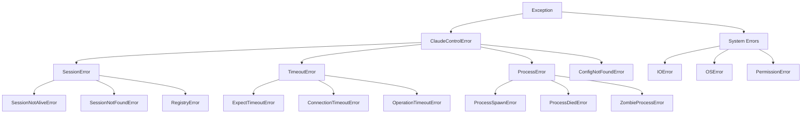
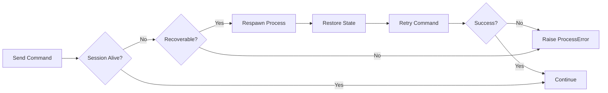

# ClaudeControl Error Handling Documentation

## Error Hierarchy



## Error Handling Layers

### 1. Process Control Layer
```python
# Location: core.py - Session class
# Catches: Process spawning and lifecycle errors

ProcessSpawnError:
  - User Message: "Failed to start {command}: {reason}"
  - Log Level: ERROR
  - Context: Command, working directory, environment
  - Recovery: None - fatal error
  - Example: "Command not found", "Permission denied"

ProcessDiedError:
  - User Message: "Process terminated unexpectedly with code {exit_code}"
  - Log Level: WARNING
  - Context: Exit code, last output, runtime
  - Recovery: Can respawn if persist=True
  - Example: Segmentation fault, killed by signal

ZombieProcessError:
  - User Message: "Process {pid} is a zombie"
  - Log Level: WARNING
  - Context: PID, session ID, last activity
  - Recovery: Automatic cleanup via psutil
  - Example: Parent died without reaping child
```

### 2. Pattern Matching Layer
```python
# Location: Session.expect(), patterns.py
# Catches: Pattern not found within timeout

ExpectTimeoutError:
  - User Message: "Timeout waiting for pattern: {patterns}"
  - Log Level: INFO (expected) or WARNING (unexpected)
  - Context: Expected patterns, recent output (last 50 lines)
  - Recovery: Retry with different pattern or longer timeout
  - Example: Prompt never appeared, wrong pattern

Key Feature: Recent output included in error message
```python
TimeoutError: Timeout (30s) waiting for ['>>>', '...']
Recent output (last 50 lines):
----------------------------------------
[actual output shown here]
----------------------------------------
```
```

### 3. Session Management Layer
```python
# Location: core.py - Registry operations
# Catches: Session lifecycle and registry errors

SessionNotAliveError:
  - User Message: "Session {id} is not active"
  - Log Level: WARNING
  - Context: Session ID, last activity, process state
  - Recovery: Create new session or reuse different one
  - Example: Trying to send to dead session

SessionNotFoundError:
  - User Message: "No session found with ID/command: {identifier}"
  - Log Level: INFO
  - Context: Search criteria, available sessions
  - Recovery: Create new session
  - Example: Reuse requested but none exists

RegistryError:
  - User Message: "Session registry operation failed"
  - Log Level: ERROR
  - Context: Operation type, registry state
  - Recovery: Rebuild registry from file system
  - Example: Registry corruption, lock timeout
```

### 4. Investigation Layer
```python
# Location: investigate.py, testing.py
# Catches: Program investigation and testing errors

SafeModeViolation:
  - User Message: "Dangerous command blocked: {command}"
  - Log Level: WARNING
  - Context: Command attempted, safety rules
  - Recovery: Skip command, continue investigation
  - Example: "rm -rf", "format c:"

InvestigationTimeout:
  - User Message: "Investigation incomplete after {time}s"
  - Log Level: WARNING
  - Context: Completed steps, partial results
  - Recovery: Return partial report
  - Example: Slow program, infinite loops

TestFailure:
  - User Message: "Test {name} failed: {reason}"
  - Log Level: INFO
  - Context: Test type, actual vs expected
  - Recovery: Continue with next test
  - Example: Startup test failed
```

## Error Recovery Strategies

### Automatic Retry with Backoff
```python
# Used for: Transient failures, slow-starting programs
# Location: Session operations, investigations

Pattern: Immediate → 1s → 2s → 5s → 10s (max 3-5 attempts)

def with_retry(operation, max_attempts=3):
    for attempt in range(max_attempts):
        try:
            return operation()
        except TimeoutError:
            if attempt < max_attempts - 1:
                wait_time = min(2 ** attempt, 10)
                time.sleep(wait_time)
            else:
                raise
```

### Session Recovery Flow


### Pattern Matching Fallbacks
```markdown
Strategy: Try multiple pattern variations
Location: expect() operations

1. Try exact pattern
2. Try case-insensitive
3. Try partial match
4. Try common variations (>>> vs >>)
5. Return recent output in error

Example progression:
"mysql>" → "mysql" → "sql>" → ">" → timeout with output
```

### Resource Cleanup on Error
```python
# Guaranteed cleanup even on error
# Location: Session.__exit__, atexit handlers

Cleanup sequence:
1. Terminate child process (SIGTERM)
2. Wait 2 seconds
3. Force kill if needed (SIGKILL)
4. Close file handles
5. Remove from registry
6. Delete named pipes
7. Log final state
```

## Error Response Formats

### CLI Error Output
```bash
# User-friendly error with actionable advice
$ ccontrol run "badcommand"
Error: Failed to spawn process 'badcommand'
Reason: Command not found

Suggestions:
- Check if the command is installed
- Verify the command name is correct
- Try using the full path to the executable
```

### Python API Error Format
```python
# Detailed error with context for debugging
try:
    session.expect(">>>", timeout=5)
except TimeoutError as e:
    print(e)
    # TimeoutError: Timeout (5s) waiting for '>>>'
    # Recent output (last 50 lines):
    # ----------------------------------------
    # Python 3.9.0
    # Type "help" for more information.
    # >>> 
    # ----------------------------------------
```

### Investigation Report Errors
```json
{
    "program": "test_app",
    "completed": false,
    "error": "SafeModeViolation",
    "error_details": {
        "message": "Dangerous command blocked",
        "command": "rm -rf /",
        "suggestion": "Run with --unsafe flag if intentional"
    },
    "partial_results": {
        "commands_found": ["help", "status"],
        "states_discovered": 2
    }
}
```

## Global Error Handlers

### Process Death Handler
```markdown
Location: Session class signal handlers
Catches: SIGCHLD from child processes

Actions:
1. Log exit status and final output
2. Mark session as dead
3. Trigger cleanup if auto_cleanup=True
4. Notify waiting expect() calls
5. Update registry
```

### Zombie Process Reaper
```markdown
Location: Registry cleanup thread
Runs: Every 60 seconds or on-demand

Actions:
1. Scan all sessions with psutil
2. Identify zombie processes
3. Attempt to reap with os.waitpid()
4. Force kill if reaping fails
5. Remove from registry
6. Log cleanup actions
```

### Resource Exhaustion Handler
```markdown
Location: Session creation, core.py
Catches: Too many sessions, memory limits

Actions:
1. Check current session count
2. Clean up dead sessions
3. Retry creation
4. Fail with helpful message if still over limit

Example message:
"Maximum sessions (20) reached. Close existing sessions or increase max_sessions in config"
```

## Error Logging

### Log Levels and Destinations
| Level | What Gets Logged | Where | When |
|-------|-----------------|-------|------|
| ERROR | Process spawn failures, crashes | File + stderr | Always |
| WARNING | Timeouts, retries, zombies | File + stderr | Default |
| INFO | Expected errors, user mistakes | File only | Default |
| DEBUG | All operations, full output | File only | When enabled |

### Logged Context
```python
# Every error log includes:
{
    "timestamp": "2024-01-20T10:30:00Z",
    "session_id": "abc123",
    "command": "mysql -u root",
    "error_type": "TimeoutError",
    "error_message": "Timeout waiting for password prompt",
    "stack_trace": "...",  # DEBUG level only
    "recent_output": "Last 20 lines...",
    "process_state": "alive|dead|zombie",
    "runtime_seconds": 45.2
}
```

## Error Prevention Strategies

### Input Validation
```python
# Prevent errors before they happen
# Location: Session.__init__, control()

Validations:
- Command exists and is executable
- Working directory exists
- Timeout is positive integer
- Environment variables are valid
- Terminal dimensions are reasonable

Example:
if not shutil.which(command.split()[0]):
    raise ValueError(f"Command not found: {command}")
```

### Safe Defaults
```markdown
| Parameter | Default | Why Safe |
|-----------|---------|----------|
| timeout | 30s | Prevents infinite wait |
| safe_mode | True | Blocks dangerous operations |
| auto_cleanup | True | Prevents resource leaks |
| max_sessions | 20 | Prevents exhaustion |
| output_limit | 10k lines | Prevents memory overflow |
```

### Defensive Programming
```python
# Always check session state before operations
if not session.is_alive():
    raise SessionError("Session not active")

# Always include timeout
session.expect(pattern, timeout=30)  # Never infinite

# Always cleanup on exit
try:
    # operations
finally:
    session.close()  # Guaranteed cleanup
```

## Error Recovery Examples

### Example 1: Resilient Server Control
```python
def start_server_resilient(max_retries=3):
    """Start server with automatic recovery"""
    for attempt in range(max_retries):
        try:
            session = control("npm run dev", reuse=True)
            session.expect("Server running", timeout=30)
            return session
        except TimeoutError:
            if attempt < max_retries - 1:
                print(f"Server slow to start, retry {attempt + 1}")
                time.sleep(5)
            else:
                raise
        except ProcessError as e:
            if "EADDRINUSE" in str(e):
                # Port in use, try to kill existing
                cleanup_sessions()
                time.sleep(2)
            else:
                raise
```

### Example 2: Investigation with Fallbacks
```python
def investigate_with_fallbacks(program):
    """Investigate with multiple strategies"""
    try:
        # Try full investigation
        return investigate_program(program, timeout=30)
    except TimeoutError:
        # Try quick probe
        return ProgramInvestigator.quick_probe(program, timeout=5)
    except ProcessError:
        # Try non-interactive analysis
        try:
            output = subprocess.check_output(
                [program, "--help"], 
                timeout=5
            )
            return {"type": "help_only", "output": output}
        except:
            return {"type": "failed", "error": "Could not analyze"}
```

### Example 3: Safe Pattern Matching
```python
def expect_with_fallbacks(session, patterns, timeout=30):
    """Try multiple pattern variations"""
    # Try exact match first
    try:
        return session.expect(patterns, timeout=timeout/3)
    except TimeoutError:
        pass
    
    # Try regex patterns
    try:
        import re
        regex_patterns = [re.compile(p, re.IGNORECASE) 
                         for p in patterns]
        return session.expect(regex_patterns, timeout=timeout/3)
    except TimeoutError:
        pass
    
    # Try common variations
    variations = []
    for p in patterns:
        variations.extend([p, p.lower(), p.upper(), f"*{p}*"])
    
    try:
        return session.expect(variations, timeout=timeout/3)
    except TimeoutError as e:
        # Include helpful context
        e.args = (f"{e.args[0]}\nTried variations: {variations}",)
        raise
```

## Critical Error Scenarios

### Scenario: System Resource Exhaustion
```markdown
Error: Too many open files / processes
Prevention: 
- Enforce max_sessions limit
- Auto-cleanup dead sessions
- Close file handles promptly

Recovery:
1. Emergency cleanup all sessions
2. Force garbage collection
3. Restart with lower limits
```

### Scenario: Hung Process Won't Die
```markdown
Error: Process ignores SIGTERM
Prevention:
- Always use timeouts
- Monitor resource usage

Recovery:
1. SIGTERM with 2s grace period
2. SIGKILL if still alive
3. OS-level process group kill
4. Manual intervention required
```

### Scenario: Corrupted Session State
```markdown
Error: Registry inconsistent with reality
Prevention:
- Atomic updates
- Regular validation

Recovery:
1. Scan actual processes
2. Rebuild registry from filesystem
3. Clean orphaned resources
4. Log discrepancies
```

## Best Practices

1. **Always include timeout** - Never allow infinite waits
2. **Include context in errors** - Recent output, attempted patterns
3. **Fail fast for unrecoverable** - Don't retry what can't succeed
4. **Clean up on any exit path** - Use try/finally or context managers
5. **Log before raising** - Capture context while available
6. **Provide actionable messages** - Tell users how to fix issues
7. **Distinguish expected vs unexpected** - Different log levels
8. **Test error paths** - Error handling needs tests too

## Summary

ClaudeControl's error handling philosophy:
- **Informative errors** - Include recent output and context
- **Automatic recovery** - When safe and sensible
- **Safe failures** - Always clean up resources
- **User-friendly messages** - Hide complexity, show solutions
- **Defensive defaults** - Prevent errors before they occur