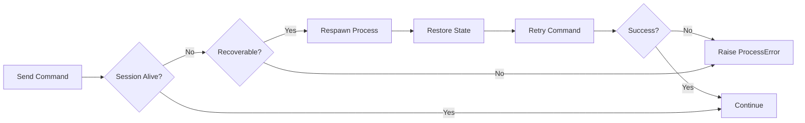
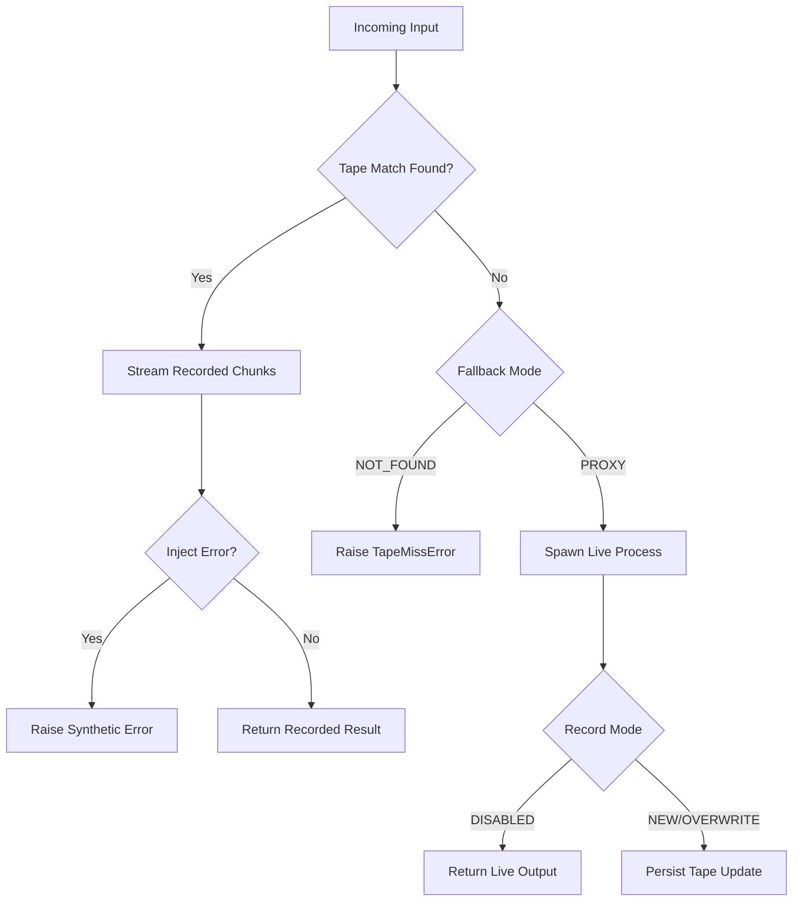

# ClaudeControl Error Handling Documentation

This document consolidates legacy `claude_control` behavior with the new Talkback-style record & replay system. It covers the expanded exception hierarchy, layer-specific handling strategies, recovery flows, logging, and user-facing diagnostics across the live automation stack and the replay/tape toolchain.

## Error Hierarchy

```mermaid
graph TD
    BaseError[Exception]
    BaseError --> CCError[ClaudeControlError]

    CCError --> SessionError[SessionError]
    CCError --> TimeoutError[TimeoutError]
    CCError --> ProcessError[ProcessError]
    CCError --> ConfigError[ConfigNotFoundError]
    CCError --> ReplayError[ReplayError]

    SessionError --> NotAlive[SessionNotAliveError]
    SessionError --> NotFound[SessionNotFoundError]
    SessionError --> Registry[RegistryError]

    ProcessError --> SpawnError[ProcessSpawnError]
    ProcessError --> DeadProcess[ProcessDiedError]
    ProcessError --> ZombieError[ZombieProcessError]

    TimeoutError --> ExpectTimeout[ExpectTimeoutError]
    TimeoutError --> ConnectionTimeout[ConnectionTimeoutError]
    TimeoutError --> OperationTimeout[OperationTimeoutError]

    ReplayError --> TapeMiss[TapeMissError]
    ReplayError --> TapeSchema[TapeSchemaError]
    ReplayError --> TapeIO[TapeIOError]
    ReplayError --> TapeLock[TapeLockError]
    ReplayError --> RedactionErr[RedactionError]
    ReplayError --> DecoratorErr[TapeDecoratorError]
    ReplayError --> LatencyErr[LatencyPolicyError]
    ReplayError --> InjectionErr[ErrorInjectionFailure]
    ReplayError --> SummaryErr[ExitSummaryError]

    BaseError --> SystemError[System Errors]
    SystemError --> IOError
    SystemError --> OSError
    SystemError --> PermissionError
```



**Key additions**:

* `ReplayError` umbrella for the record/playback stack (`TapeMissError`, `TapeSchemaError`, `TapeIOError`, `TapeLockError`, `RedactionError`, `TapeDecoratorError`, `LatencyPolicyError`, `ErrorInjectionFailure`, `ExitSummaryError`).
* Schema and redaction failures surface rich diagnostics so users can repair tapes without re-recording.
* Policy errors (`LatencyPolicyError`, `ErrorInjectionFailure`) guard deterministic simulation settings.

## Error Handling Layers

### 1. Process Control Layer (unchanged)

```python
# Location: core.py - Session class
# Catches: Process spawning and lifecycle errors

ProcessSpawnError:
  - User Message: "Failed to start {command}: {reason}"
  - Log Level: ERROR
  - Context: Command, working directory, environment
  - Recovery: None - fatal error
  - Example: "Command not found", "Permission denied"

ProcessDiedError:
  - User Message: "Process terminated unexpectedly with code {exit_code}"
  - Log Level: WARNING
  - Context: Exit code, last output, runtime
  - Recovery: Can respawn if persist=True
  - Example: Segmentation fault, killed by signal

ZombieProcessError:
  - User Message: "Process {pid} is a zombie"
  - Log Level: WARNING
  - Context: PID, session ID, last activity
  - Recovery: Automatic cleanup via psutil
  - Example: Parent died without reaping child
```

### 2. Pattern Matching Layer (live + replay)

```python
# Location: Session.expect(), patterns.py, replay.Player
# Catches: Prompt or pattern not found within timeout or replay mismatch

ExpectTimeoutError:
  - User Message: "Timeout waiting for pattern: {patterns}"
  - Log Level: INFO (expected) or WARNING (unexpected)
  - Context: Expected patterns, recent output (last 50 lines)
  - Recovery: Retry with different pattern or longer timeout
  - Example: Prompt never appeared, wrong pattern

TapeMissError:
  - User Message: "No tape exchange matched input: {fingerprint}"
  - Log Level: ERROR when fallback=NOT_FOUND, INFO when fallback=PROXY
  - Context: Program, args, cwd, prompt signature, stdin hash
  - Recovery: Depends on fallback mode (proxy to live process or fail fast)
  - Example: New CLI prompt, unmatched stdin mutation

Key Feature: Recent output and normalized comparison details included in errors when debugging is enabled.
```python
TimeoutError: Timeout (30s) waiting for ['>>>', '...']
Recent output (last 50 lines):
----------------------------------------
[actual output shown here]
----------------------------------------
```

### 3. Session Management Layer

```python
# Location: core.py - Registry operations
# Catches: Session lifecycle and registry errors

SessionNotAliveError:
  - User Message: "Session {id} is not active"
  - Log Level: WARNING
  - Context: Session ID, last activity, process state
  - Recovery: Create new session or reuse different one
  - Example: Trying to send to dead session

SessionNotFoundError:
  - User Message: "No session found with ID/command: {identifier}"
  - Log Level: INFO
  - Context: Search criteria, available sessions
  - Recovery: Create new session
  - Example: Reuse requested but none exists

RegistryError:
  - User Message: "Session registry operation failed"
  - Log Level: ERROR
  - Context: Operation type, registry state
  - Recovery: Rebuild registry from file system
  - Example: Registry corruption, lock timeout
```

### 4. Replay & Tape Management Layer

```python
# Location: replay.store, replay.record, replay.play, replay.summary
# Catches: Tape IO, schema, decorator, latency/error-policy failures

TapeSchemaError:
  - User Message: "Tape {path} failed schema validation"
  - Log Level: ERROR
  - Context: Validation errors, field path, offending value
  - Recovery: Fix tape manually or re-record; strict mode aborts load
  - Example: Missing exchanges array, invalid chunk structure

TapeIOError:
  - User Message: "Unable to read/write tape {path}: {reason}"
  - Log Level: ERROR
  - Context: File path, attempted operation, errno
  - Recovery: Retry, ensure permissions, disk space
  - Example: Atomic rename failure, read-only filesystem

TapeLockError:
  - User Message: "Could not acquire lock for tape {path}"
  - Log Level: WARNING
  - Context: Lock owner, retry count
  - Recovery: Wait/backoff; fallback to live run if configured
  - Example: Concurrent overwrite via CLI while session recording

RedactionError:
  - User Message: "Secret redaction failed for tape {path}"
  - Log Level: ERROR
  - Context: Pattern name, offending snippet (redacted)
  - Recovery: Disable redaction via env for debugging or adjust patterns
  - Example: Non-UTF8 secret chunk during redact-in-place

TapeDecoratorError:
  - User Message: "Tape decorator raised {exc}"
  - Log Level: WARNING
  - Context: Decorator name, exchange index
  - Recovery: Skip decorator result, continue recording
  - Example: Custom decorator accessing missing metadata

LatencyPolicyError / ErrorInjectionFailure:
  - User Message: "Latency/Error policy produced invalid value"
  - Log Level: ERROR
  - Context: Policy callable, provided context snapshot
  - Recovery: Disable policy or fix callable
  - Example: Callable returns negative latency, probability >100

ExitSummaryError:
  - User Message: "Failed to emit replay summary"
  - Log Level: WARNING
  - Context: Summary path, collected stats
  - Recovery: Log-only; session completes successfully
  - Example: stdout closed early, JSON summary write failure
```

### 5. Investigation & Testing Layer (live + replay)

```python
# Location: investigate.py, testing.py, replay.summary
# Catches: Program investigation and testing errors

SafeModeViolation:
  - User Message: "Dangerous command blocked: {command}"
  - Log Level: WARNING
  - Context: Command attempted, safety rules
  - Recovery: Skip command, continue investigation
  - Example: "rm -rf", "format c:"

InvestigationTimeout:
  - User Message: "Investigation incomplete after {time}s"
  - Log Level: WARNING
  - Context: Completed steps, partial results
  - Recovery: Return partial report
  - Example: Slow program, infinite loops

TestFailure:
  - User Message: "Test {name} failed: {reason}"
  - Log Level: INFO
  - Context: Test type, actual vs expected
  - Recovery: Continue with next test
  - Example: Startup test failed
```

## Error Recovery Strategies

### Automatic Retry with Backoff

```python
# Used for: Transient failures, slow-starting programs, tape lock contention
# Location: Session operations, investigations, replay.store

Pattern: Immediate → 1s → 2s → 5s → 10s (max 3-5 attempts)

def with_retry(operation, max_attempts=3):
    for attempt in range(max_attempts):
        try:
            return operation()
        except (TimeoutError, TapeLockError):
            if attempt < max_attempts - 1:
                wait_time = min(2 ** attempt, 10)
                time.sleep(wait_time)
            else:
                raise
```

### Session Recovery Flow



### Replay Miss Handling



### Pattern Matching Fallbacks

```markdown
Strategy: Try multiple pattern variations
Location: expect() operations and replay.Player matching

1. Try exact pattern
2. Try case-insensitive
3. Try partial match
4. Try common variations (>>> vs >>)
5. Return recent output and normalized comparison diff in error

Example progression:
"mysql>" → "mysql" → "sql>" → ">" → timeout with output or tape miss report
```

### Resource Cleanup on Error

```python
# Guaranteed cleanup even on error
# Location: Session.__exit__, replay.Player teardown, atexit handlers

Cleanup sequence:
1. Terminate child process (SIGTERM)
2. Wait 2 seconds
3. Force kill if needed (SIGKILL)
4. Close file handles (logfile_read, tape files)
5. Remove from registry and release tape locks
6. Delete named pipes/temp files
7. Log final state and summary metrics
```

## Error Response Formats

### CLI Error Output

```bash
# User-friendly error with actionable advice
$ ccontrol play sqlite3 -batch
Error: No tape exchange matched input for sqlite3 -batch
Context:
  tapes: ./tapes/sqlite3/*.json5
  fingerprint: sendline('select 1;')
Suggestions:
- Run with --fallback proxy to capture a live session
- Record new tape via `ccontrol rec -- sqlite3 -batch`
- Adjust matchers or ignore lists if prompts change
```

### Python API Error Format

```python
# Detailed error with context for debugging
from claudecontrol import Session
from claudecontrol.replay import RecordMode, FallbackMode

try:
    session = Session(
        "sqlite3",
        tapes_path="./tapes",
        record=RecordMode.DISABLED,
        fallback=FallbackMode.NOT_FOUND,
    )
    session.expect("sqlite> ", timeout=5)
except TimeoutError as e:
    print(e)
    # TimeoutError: Timeout (5s) waiting for 'sqlite> '
    # Recent output (last 50 lines):
    # ----------------------------------------
    # ...
    # ----------------------------------------
except TapeMissError as e:
    print(e.diagnostics)
    # TapeMissError: no exchange matched fingerprint <hash>
    # Normalized differences:
    #   expected prompt: 'sqlite> '
    #   actual prompt: 'sqlite3> '
```

### Investigation Report Errors

```json
{
    "program": "test_app",
    "completed": false,
    "error": "SafeModeViolation",
    "error_details": {
        "message": "Dangerous command blocked",
        "command": "rm -rf /",
        "suggestion": "Run with --unsafe flag if intentional"
    },
    "partial_results": {
        "commands_found": ["help", "status"],
        "states_discovered": 2,
        "tapes_used": ["sqlite3/select-1.json5"],
        "tapes_missing": ["sqlite3/pragma.json5"]
    }
}
```

### Exit Summary Errors

```markdown
===== SUMMARY (claude_control) =====
New tapes:
- sqlite3/select-1.json5
Unused tapes:
- git/status.json5
Warnings:
- Failed to write summary file: ExitSummaryError(Errno 5)
```

## Global Error Handlers

### Process Death Handler

```markdown
Location: Session class signal handlers
Catches: SIGCHLD from child processes

Actions:
1. Log exit status and final output
2. Mark session as dead
3. Trigger cleanup if auto_cleanup=True
4. Notify waiting expect() calls
5. Update registry and replay summary metrics
```

### Zombie Process Reaper

```markdown
Location: Registry cleanup thread
Runs: Every 60 seconds or on-demand

Actions:
1. Scan all sessions with psutil
2. Identify zombie processes
3. Attempt to reap with os.waitpid()
4. Force kill if reaping fails
5. Remove from registry
6. Log cleanup actions
```

### Resource Exhaustion Handler

```markdown
Location: Session creation, core.py
Catches: Too many sessions, memory limits

Actions:
1. Check current session count and active tape players
2. Clean up dead sessions and release tape locks
3. Retry creation
4. Fail with helpful message if still over limit

Example message:
"Maximum sessions (20) reached. Close existing sessions or increase max_sessions in config"
```

## Replay-Specific Diagnostics

| Area | Error | Mitigation |
|------|-------|------------|
| Tape loading | TapeSchemaError | Run `ccontrol tapes validate --strict` to locate structural issues |
| Matching | TapeMissError | Record new tape (`ccontrol rec`), tweak matchers/normalizers, or enable proxy fallback |
| Decorators | TapeDecoratorError | Inspect custom decorator stack; exceptions downgraded to warnings by default |
| Redaction | RedactionError | Set `CLAUDECONTROL_REDACT=0` temporarily or update regex patterns |
| Latency/Error policies | LatencyPolicyError / ErrorInjectionFailure | Ensure policies return valid integers/probabilities; seed RNG for determinism |
| Summary | ExitSummaryError | Review stdout/stderr availability; summary failure never aborts sessions |

## Error Logging

### Log Levels and Destinations

| Level | What Gets Logged | Where | When |
|-------|-----------------|-------|------|
| ERROR | Process spawn failures, tape schema/IO errors, crashes | File + stderr | Always |
| WARNING | Timeouts, retries, zombies, decorator failures, exit summary issues | File + stderr | Default |
| INFO | Expected errors, user mistakes, tape misses with proxy fallback | File only | Default |
| DEBUG | All operations, full output, normalized diff diagnostics | File only | When enabled |

### Logged Context

```python
# Every error log includes:
{
    "timestamp": "2024-01-20T10:30:00Z",
    "session_id": "abc123",
    "program": "mysql",
    "args": ["-u", "root"],
    "tape_path": "tapes/mysql/login.json5",  # when applicable
    "error_type": "TapeMissError",
    "error_message": "Timeout waiting for password prompt",
    "recent_output": "Last 20 lines...",
    "match_diagnostics": {
        "expected_prompt": "mysql> ",
        "actual_prompt": "mysql 8.0> ",
        "ignored_env": ["PWD", "SHLVL"]
    },
    "process_state": "alive|dead|zombie|replay",
    "runtime_seconds": 45.2,
    "record_mode": "NEW",
    "fallback_mode": "NOT_FOUND"
}
```

### Structured Summary Logs

Replay summary generation emits structured events to aid CI diagnostics:

```json
{
  "event": "replay.summary",
  "new_tapes": ["sqlite3/select-1.json5"],
  "unused_tapes": ["git/status.json5"],
  "errors": [],
  "record_mode": "NEW",
  "fallback_mode": "NOT_FOUND"
}
```

## CLI & Configuration Failures

* CLI flag conflicts (e.g., `--record disabled` with `--fallback proxy` missing tapes) raise `SystemExit` with actionable help.
* Config parsing errors bubble as `ConfigNotFoundError` or `ConfigFormatError`, with CLI suggestions to run `ccontrol config --reset`.
* Tape management subcommands (`tapes validate|list|redact`) use the same `ReplayError` hierarchy, ensuring consistent messaging across automation, CLI, and tests.

## Testing Considerations

* CI defaults to `record=DISABLED` + `fallback=NOT_FOUND`; tape misses fail fast.
* Replay-enabled tests capture normalized diff diagnostics on failure to help update fixtures.
* `tests/` utilities assert that redaction errors are warnings during authoring but fatal in CI strict mode.

By aligning legacy process/session safeguards with the new replay/tape stack, `claude_control` delivers deterministic automation while surfacing actionable guidance whenever errors occur.
