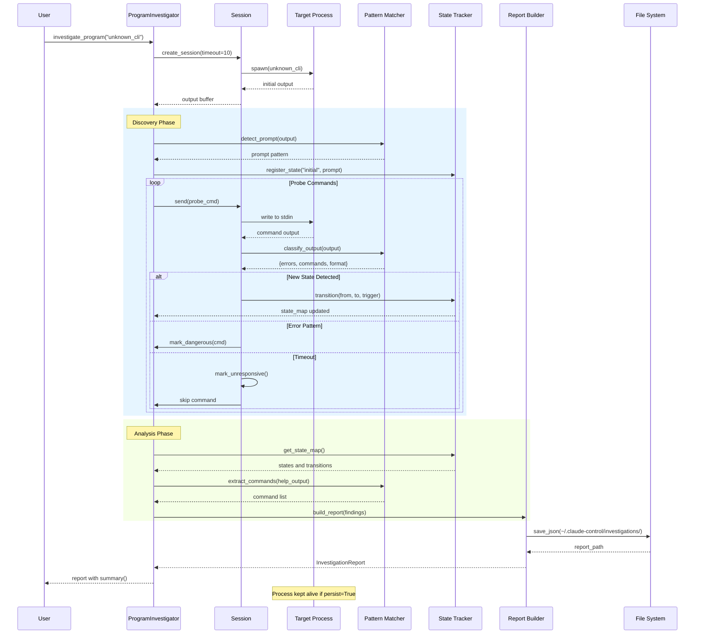
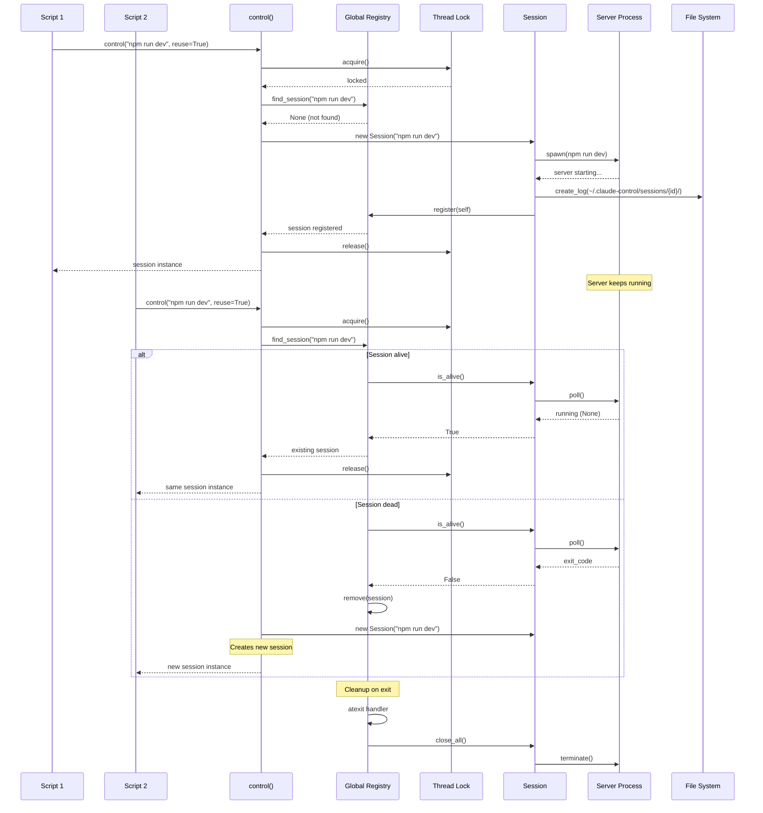
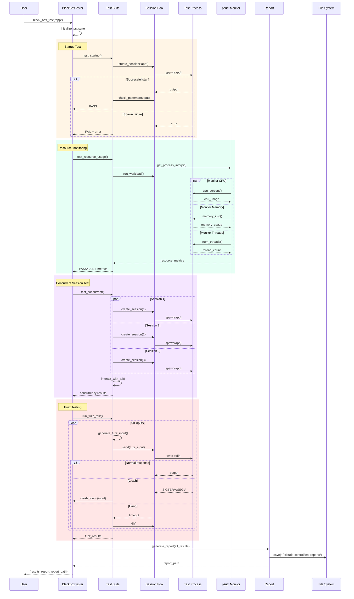
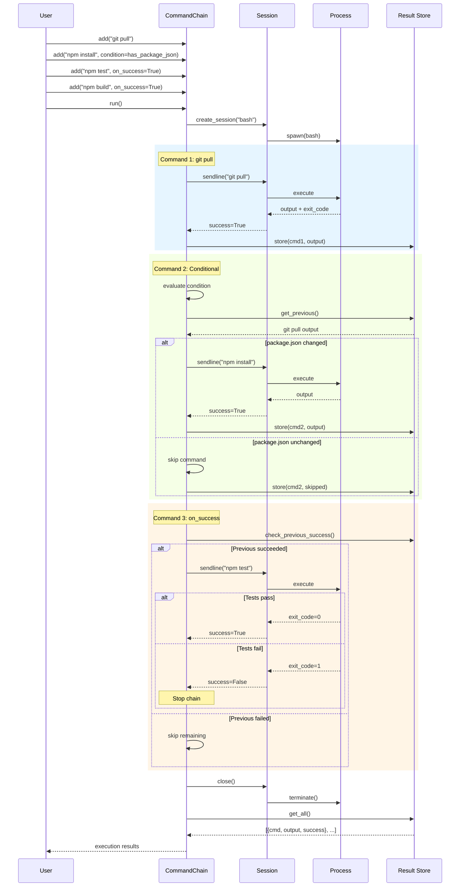
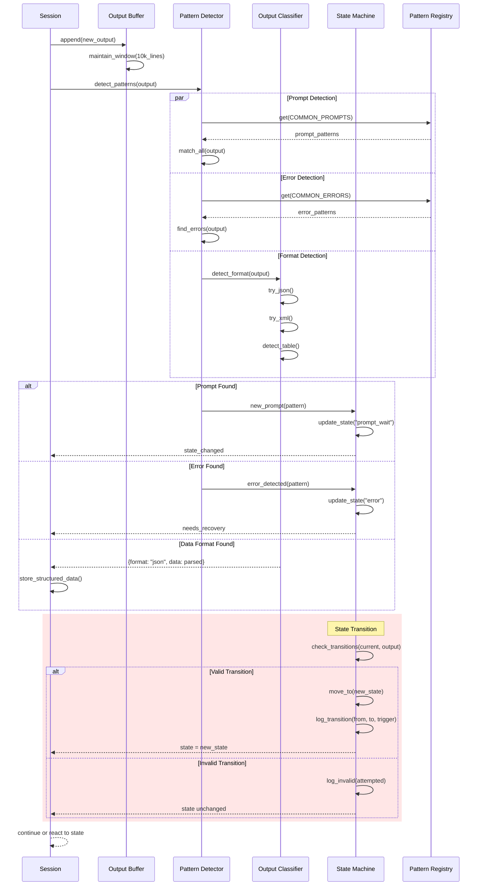
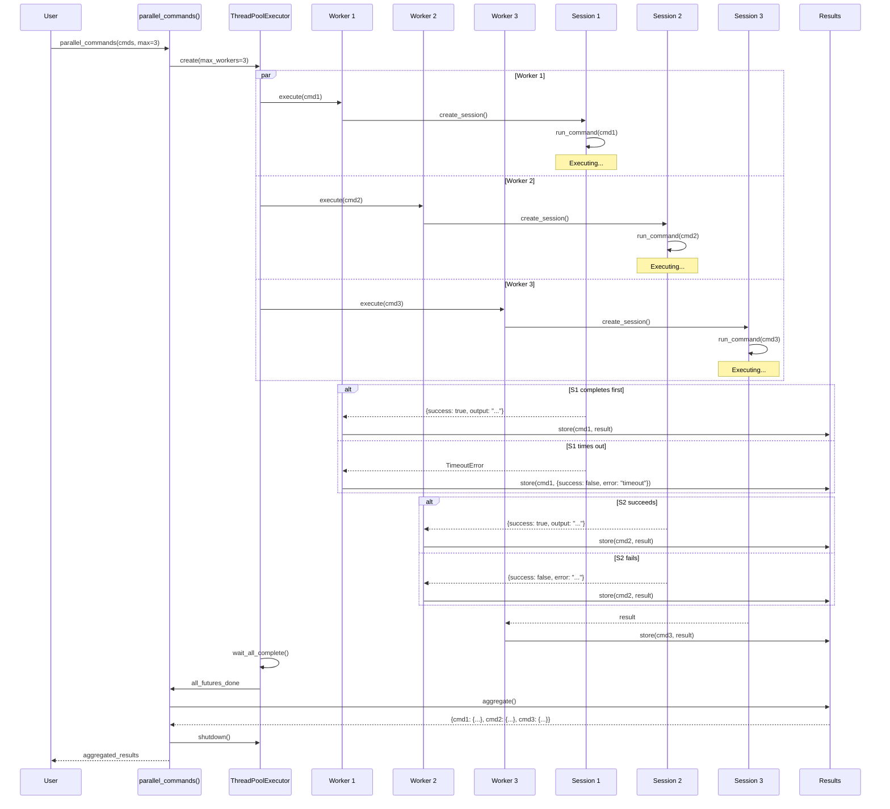
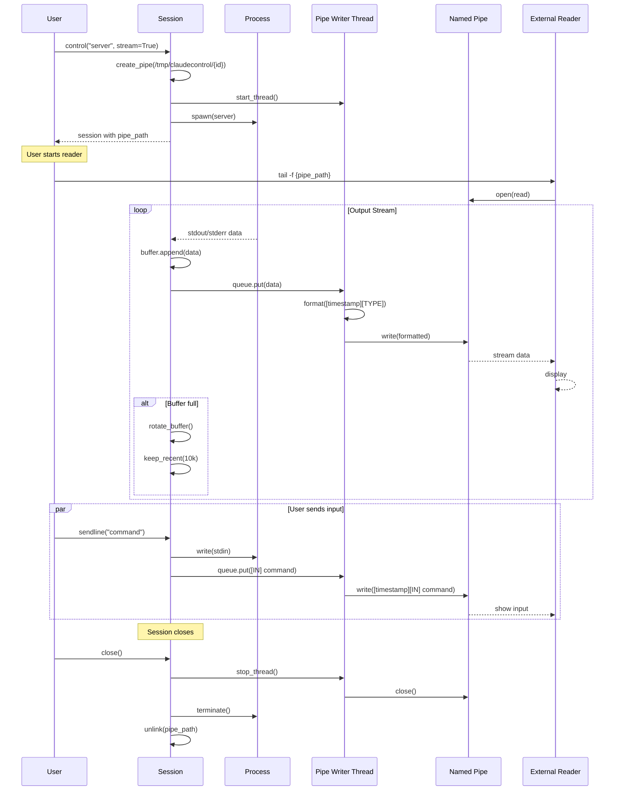

# ClaudeControl Sequence Diagrams

## 1. Program Investigation Flow
**Trigger:** User runs `investigate_program("unknown_cli")`
**Outcome:** Complete interface map and behavioral report of the CLI program

### Performance Notes
- Typical execution: 5-60 seconds depending on program complexity
- Bottleneck: Waiting for program responses (timeout critical)
- Optimization: Parallel probing when safe

### Failure Modes
- Program doesn't start: ProcessError raised immediately
- No prompt detected: Falls back to send-only mode
- Hangs on input: Timeout protection (default 10s)
- Dangerous operations: Safe mode blocks execution

---

## 2. Session Reuse and Registry Management
**Trigger:** Multiple calls to `control("server", reuse=True)`
**Outcome:** Efficient session reuse across script runs

### Performance Notes
- Registry lookup: O(n) with typically <20 sessions
- Lock contention: Minimal, held briefly
- Session creation: ~10-100ms overhead

### Failure Modes
- Registry corruption: Rebuilt on next access
- Zombie sessions: Cleaned by psutil check
- Lock deadlock: Timeout protection (30s)

### Concurrency
- Thread-safe via global lock
- One writer at a time for registry
- Sessions themselves not thread-safe

---

## 3. Black Box Testing Flow
**Trigger:** `black_box_test("app", timeout=10)`
**Outcome:** Comprehensive test report with pass/fail for multiple test categories

### Performance Notes
- Full test suite: 10-120 seconds
- Parallel tests: Limited by system resources
- Fuzz testing: Configurable iterations (default 50)

### Failure Modes
- Test process crash: Caught and reported
- Resource exhaustion: Killed with report
- Infinite loops: Timeout protection
- System limits: Graceful degradation

---

## 4. Command Chain Execution
**Trigger:** CommandChain with conditional execution
**Outcome:** Sequential execution with condition-based flow control

### Performance Notes
- Sequential execution: No parallelization
- Condition evaluation: <1ms overhead
- State preserved between commands

### Failure Modes
- Command failure: Stops chain if on_success=True
- Condition error: Treated as False, command skipped
- Session death: Chain aborts with error

---

## 5. Pattern Detection and State Transition
**Trigger:** Output from CLI program triggers state change
**Outcome:** Accurate state tracking and pattern extraction

### Performance Notes
- Pattern matching: ~1ms per 100 lines
- JSON parsing: Cached if unchanged
- State transitions: O(1) lookup

### Failure Modes
- Ambiguous patterns: First match wins
- Malformed data: Logged, processing continues
- State loops: Detected and broken

---

## 6. Parallel Command Execution
**Trigger:** `parallel_commands(["cmd1", "cmd2", "cmd3"])`
**Outcome:** Concurrent execution with result aggregation

### Performance Notes
- Parallel speedup: Limited by slowest command
- Thread pool overhead: ~1ms per worker
- Max concurrent: System dependent (default 10)

### Failure Modes
- Worker crash: Caught, error in result
- Resource exhaustion: Queued execution
- Deadlock: Timeout on all operations

### Concurrency
- Thread-safe result aggregation
- Independent sessions per worker
- No shared state between commands

---

## 7. Real-time Stream Processing
**Trigger:** Session with `stream=True` creating named pipe
**Outcome:** Real-time output streaming to external consumers

### Performance Notes
- Stream latency: <1ms typically
- Buffer size: 64KB OS pipe buffer
- No persistence: Real-time only

### Failure Modes
- Reader disconnects: Writer continues
- Pipe full: Blocks writer (rare)
- No reader: Data discarded

---

## Summary of Complex Interactions

These sequence diagrams illustrate ClaudeControl's most complex flows:

1. **Investigation** - Multi-phase discovery with state tracking
2. **Session Reuse** - Thread-safe registry with lifecycle management  
3. **Black Box Testing** - Parallel test execution with monitoring
4. **Command Chains** - Conditional sequential execution
5. **Pattern Detection** - Real-time classification and state management
6. **Parallel Execution** - Concurrent command processing
7. **Stream Processing** - Real-time output streaming via named pipes

Each flow demonstrates:
- Multiple component coordination (3+ actors)
- Asynchronous or parallel operations
- Complex error handling and recovery
- Critical timing and ordering constraints

The diagrams focus on the non-obvious interactions that make ClaudeControl powerful yet reliable for CLI automation, testing, and discovery.