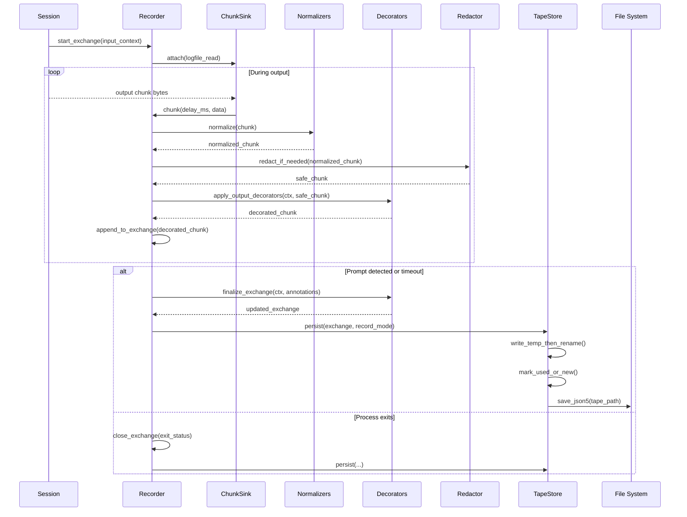
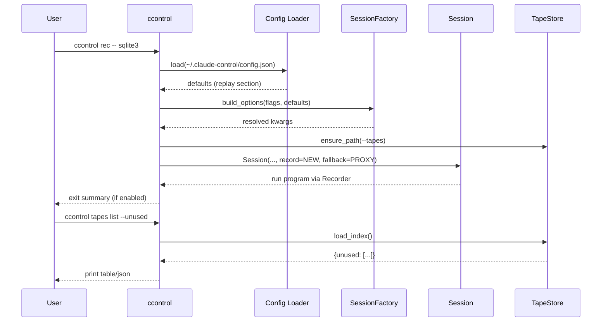
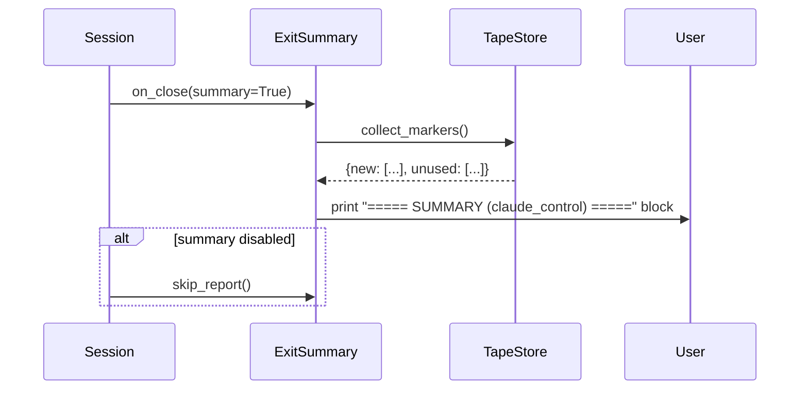
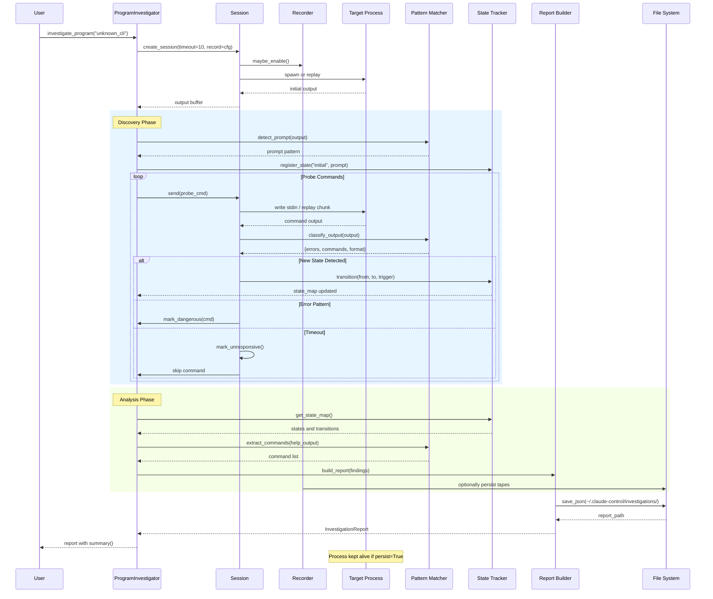
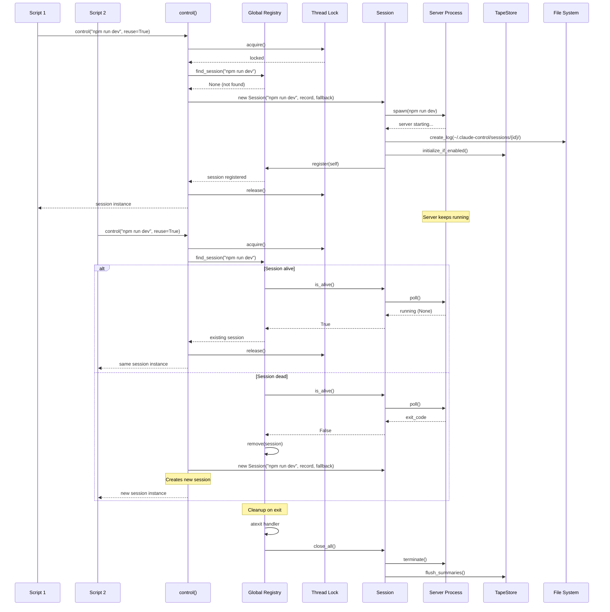
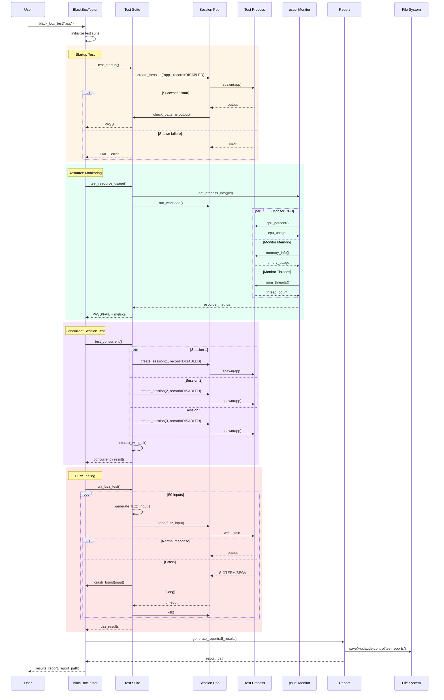
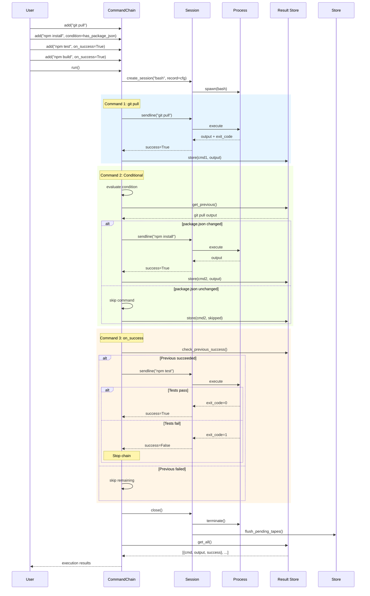
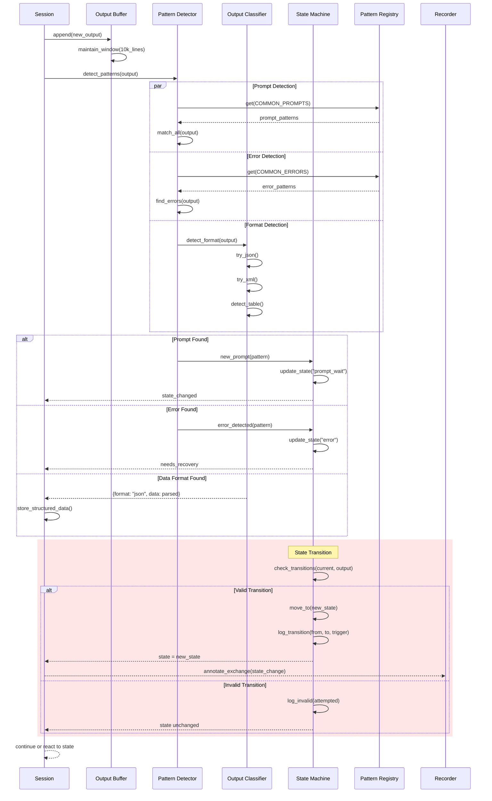
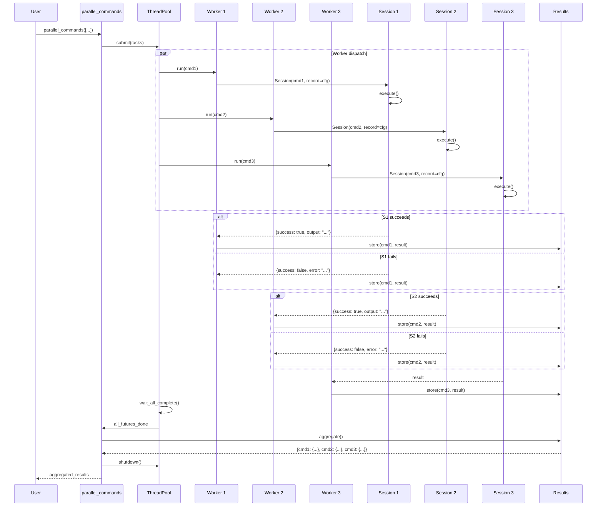
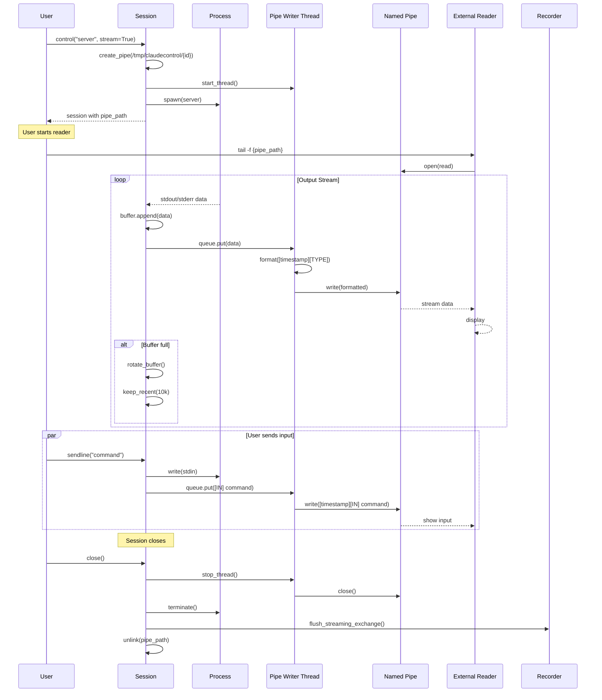

# ClaudeControl Sequence Diagrams

The following sequence diagrams capture both the long-standing automation/investigation flows and the newly added Talkback-style recording & replay system. Sections are ordered to show how the replay stack integrates seamlessly with existing components.

---

## 1. Session Lifecycle with Record/Replay Transport
**Trigger:** Any `Session(...)` creation with default or replay-aware options  
**Outcome:** Session routes I/O through either a live `pexpect` process or the replay `Player`, optionally recording via the `Recorder`

```mermaid
sequenceDiagram
    participant Caller as Library/CLI User
    participant Session
    participant Modes as Record/Fallback Modes
    participant Store as TapeStore
    participant Recorder
    participant Player
    participant Live as pexpect.spawn Process

    Caller->>Session: Session(program, record=NEW, fallback=PROXY, ...)
    Session->>Modes: resolve(record, fallback)
    Modes-->>Session: {record_mode, fallback_mode}

    Session->>Store: load_index(tapes_path)
    Store-->>Session: TapeIndex + metadata

    alt playback enabled
        Session->>Player: configure(index, latency, error_rate, decorators)
        Player-->>Session: transport = ReplayTransport
    else live execution
        Session->>Live: spawn(program, args, env, cwd)
        Session->>Recorder: configure(tape_builder, decorators, normalizers)
        Recorder-->>Session: capture hooks (logfile_read, send intercepts)
    end

    Session-->>Caller: ready session (send/expect/close)

    Note over Session,Recorder,Player: Recorder & Player share MatchingContext, decorators, redactors
```

### Integration Notes
- `Session` now accepts replay parameters but keeps backward-compatible defaults.
- TapeStore loads tapes once at session startup, guarded by locks for thread-safety.
- Recorder attaches to the existing `logfile_read` sink; Player replaces the transport interface when replaying.

---

## 2. Tape Recording Pipeline
**Trigger:** Session operating in record or proxy mode while running against a live process  
**Outcome:** Exchanges are segmented, decorated, normalized, redacted, and persisted as JSON5 tapes



### Performance Notes
- Chunk capture reuses the existing Session buffer; per-chunk normalization stays under ~1 ms for 100-line windows.
- Tape writes are atomic (temp file + rename) and guarded by `portalocker`-backed locks.

### Failure Modes
- Redaction failure: raises `RedactionError`, aborting write to protect secrets.
- Schema validation errors: surfaced via `SchemaError`, leaving original tape untouched.

---

## 3. Tape Playback & Fallback Handling
**Trigger:** Session running with Player transport (e.g., `record=DISABLED`, `fallback=NOT_FOUND|PROXY`)  
**Outcome:** Matched exchanges stream recorded output with latency/error policies, with optional live fallback

```mermaid
sequenceDiagram
    participant Session
    participant Player
    participant Store as TapeIndex
    participant Matcher as Matchers
    participant Latency
    participant Errors as Error Injector
    participant Live as Live Process

    Session->>Player: sendline("select 1;")
    Player->>Matcher: build_context(program, args, env, prompt, stdin)
    Matcher->>Store: lookup(context)

    alt Match found
        Store-->>Matcher: tape_ref
        Matcher-->>Player: matched_exchange
        Player->>Latency: schedule(chunk.delay_ms, overrides)
        loop For each recorded chunk
            Latency->>Player: wait(delay)
            Player->>Session: deliver_output(chunk)
            Player->>Errors: maybe_inject(ctx)
            Errors-->>Player: continue | inject_failure
        end
        alt Recorded exit
            Player->>Session: propagate_exit(code)
        end
        Player->>Store: mark_used(tape_path)
    else No match
        alt fallback == NOT_FOUND
            Player-->>Session: raise TapeMissError
        else fallback == PROXY
            Player->>Live: spawn(program)
            Live-->>Session: live_output
            Session->>Recorder: (optional) record if record_mode allows
        end
    end
```

### Behavior Highlights
- Latency policies accept constants, ranges, or callables; Player enforces ≤50 ms jitter per chunk.
- Error injection may truncate output or raise synthetic failures with deterministic RNG seeding.
- Proxy fallback optionally records new tapes when `record != DISABLED`.

---

## 4. CLI Record/Replay Commands (`ccontrol`)
**Trigger:** User invokes new CLI subcommands (`rec`, `play`, `proxy`, `tapes ...`)  
**Outcome:** Commands configure Session defaults, run programs, and manage tape artifacts



### Supported Operations
- `rec`, `play`, and `proxy` toggle record/fallback defaults matching Talkback semantics.
- `tapes list|validate|redact` operate on TapeStore metadata with schema and secret checks.

---

## 5. Exit Summary Accounting
**Trigger:** Session or CLI process shutdown with summaries enabled  
**Outcome:** New and unused tapes are reported to stdout



### Notes
- TapeStore tracks `mark_used` and `mark_new` calls during record/playback.
- Summary respects `--silent` but still logs to debug when enabled.

---

## 6. Program Investigation Flow (Existing Feature)
**Trigger:** User runs `investigate_program("unknown_cli")`  
**Outcome:** Complete interface map and behavioral report of the CLI program, optionally recording tapes when enabled



### Performance Notes
- Typical execution: 5-60 seconds depending on program complexity and replay mode.
- When replaying, latency policies ensure consistent pacing for learned prompts.

### Failure Modes
- Program doesn't start: ProcessError raised immediately.
- No prompt detected: Falls back to send-only mode (still records raw output).
- Hangs on input: Timeout protection (default 10s).
- Dangerous operations: Safe mode blocks execution.
- Tape miss when recording disabled: surfaces TapeMissError if fallback is `NOT_FOUND`.

---

## 7. Session Reuse and Registry Management (Existing Feature)
**Trigger:** Multiple calls to `control("server", reuse=True)`  
**Outcome:** Efficient session reuse across script runs with replay-aware cleanup



### Performance Notes
- Registry lookup: O(n) with typically <20 sessions
- Lock contention: Minimal, held briefly
- Session creation: ~10-100ms overhead

### Failure Modes
- Registry corruption: Rebuilt on next access
- Zombie sessions: Cleaned by psutil check
- Lock deadlock: Timeout protection (30s)
- TapeStore load failure: Falls back to live mode with warning

### Concurrency
- Thread-safe via global lock
- One writer at a time for registry
- Sessions themselves not thread-safe
- TapeStore guarded by RW locks for concurrent playback

---

## 8. Black Box Testing Flow (Existing Feature)
**Trigger:** `black_box_test("app", timeout=10)`  
**Outcome:** Comprehensive test report with pass/fail for multiple test categories



### Performance Notes
- Full test suite: 10-120 seconds
- Parallel tests: Limited by system resources
- Fuzz testing: Configurable iterations (default 50)

### Failure Modes
- Test process crash: Caught and reported
- Resource exhaustion: Killed with report
- Infinite loops: Timeout protection
- System limits: Graceful degradation
- Tape miss during replay: surfaces error immediately (CI default `record=DISABLED`, `fallback=NOT_FOUND`)

---

## 9. Command Chain Execution (Existing Feature)
**Trigger:** CommandChain with conditional execution  
**Outcome:** Sequential execution with condition-based flow control



### Performance Notes
- Sequential execution: No parallelization
- Condition evaluation: <1ms overhead
- State preserved between commands

### Failure Modes
- Command failure: Stops chain if on_success=True
- Condition error: Treated as False, command skipped
- Session death: Chain aborts with error
- Tape write failure: Rolls back to live execution and logs warning

---

## 10. Pattern Detection and State Transition (Existing Feature)
**Trigger:** Output from CLI program triggers state change  
**Outcome:** Accurate state tracking and pattern extraction



### Performance Notes
- Pattern matching: ~1ms per 100 lines
- JSON parsing: Cached if unchanged
- State transitions: O(1) lookup

### Failure Modes
- Ambiguous patterns: First match wins
- Malformed data: Logged, processing continues
- State loops: Detected and broken
- Annotation failure: Recorder keeps raw output without extra metadata

---

## 11. Parallel Command Execution (Existing Feature)
**Trigger:** `parallel_commands(["cmd1", "cmd2", "cmd3"])`  
**Outcome:** Concurrent execution with result aggregation



### Performance Notes
- Parallel speedup: Limited by slowest command
- Thread pool overhead: ~1ms per worker
- Max concurrent: System dependent (default 10)

### Failure Modes
- Worker crash: Caught, error in result
- Resource exhaustion: Queued execution
- Deadlock: Timeout on all operations
- TapeStore contention: Background index reads share RW locks safely

### Concurrency
- Thread-safe result aggregation
- Independent sessions per worker
- No shared state between commands
- Per-session TapeStore handles mark_used/new independently

---

## 12. Real-time Stream Processing (Existing Feature)
**Trigger:** Session with `stream=True` creating named pipe  
**Outcome:** Real-time output streaming to external consumers



### Performance Notes
- Stream latency: <1ms typically
- Buffer size: 64KB OS pipe buffer
- No persistence: Real-time only

### Failure Modes
- Reader disconnects: Writer continues
- Pipe full: Blocks writer (rare)
- No reader: Data discarded
- Recording disabled: Recorder skips streaming exchange gracefully

---

## Summary of Complex Interactions

These sequence diagrams illustrate ClaudeControl's most complex flows:

1. **Session Lifecycle** - Unified record/replay transport selection
2. **Tape Recording** - Deterministic capture, normalization, and persistence
3. **Tape Playback** - Match-driven output streaming with latency/error policies
4. **CLI Record/Replay** - User-facing orchestration and tape tooling
5. **Exit Summary** - Accounting for new and unused tapes
6. **Investigation** - Multi-phase discovery with optional tape capture
7. **Session Reuse** - Thread-safe registry with replay-aware cleanup
8. **Black Box Testing** - Parallel test execution with explicit record modes
9. **Command Chains** - Conditional sequential execution with tape flushes
10. **Pattern Detection** - Real-time classification feeding Recorder annotations
11. **Parallel Execution** - Concurrent command processing across sessions
12. **Stream Processing** - Real-time output streaming compatible with Recorder

Each flow demonstrates:
- Multiple component coordination (3+ actors)
- Asynchronous or parallel operations
- Complex error handling and recovery
- Critical timing and ordering constraints

The diagrams focus on the non-obvious interactions that make ClaudeControl powerful yet reliable for CLI automation, testing, discovery, and deterministic record/replay.
