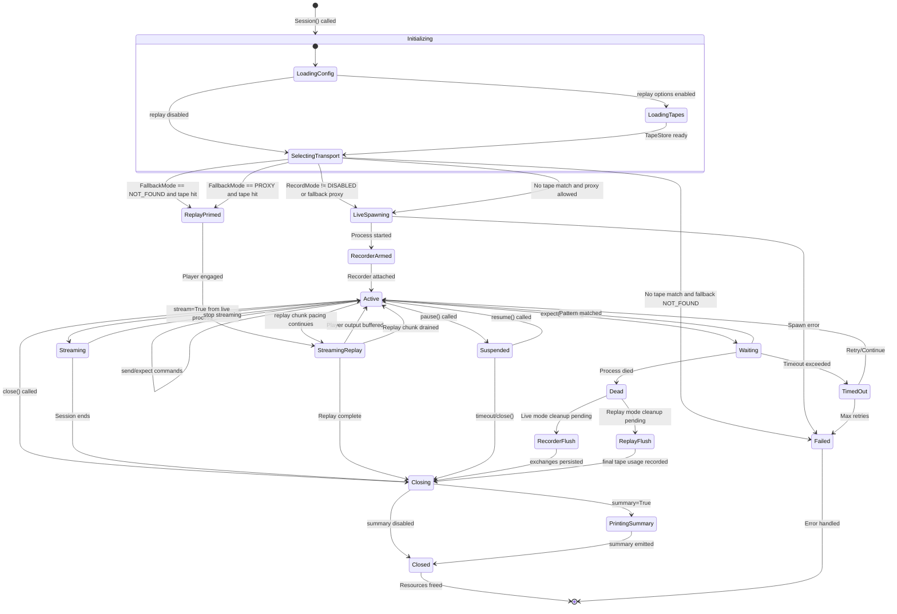
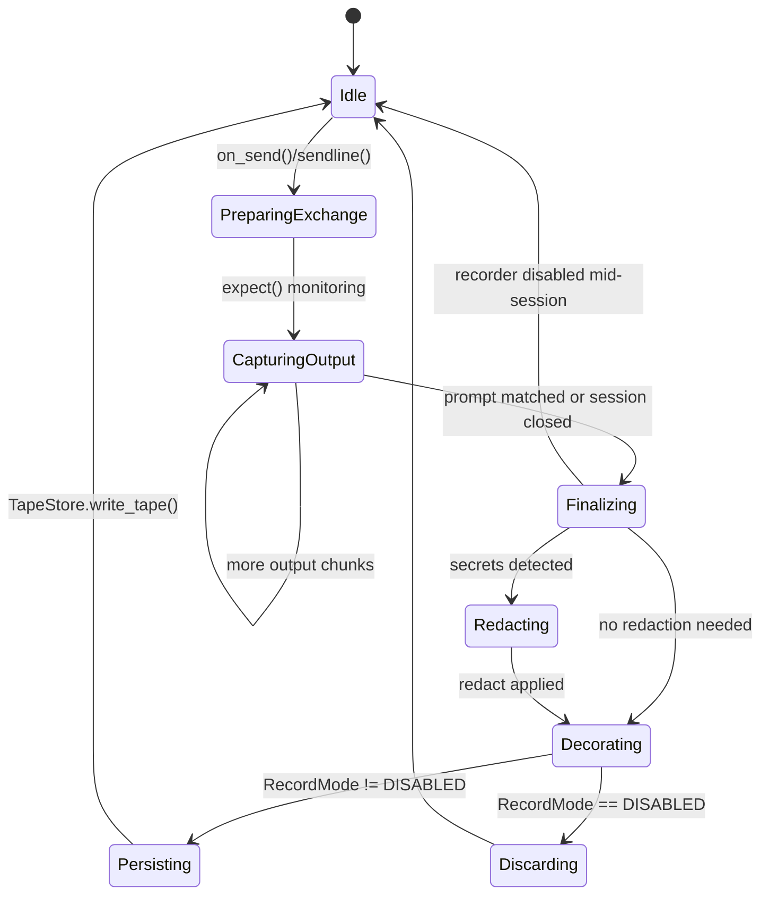
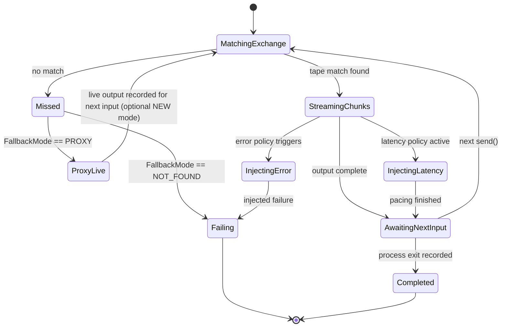
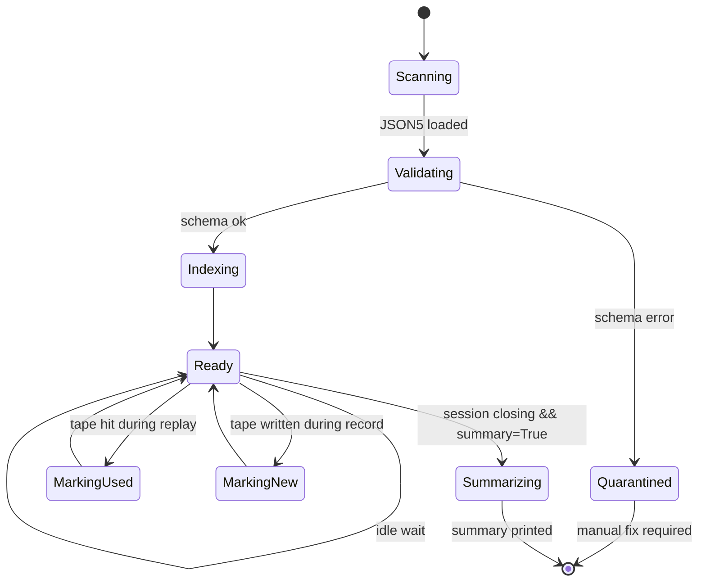
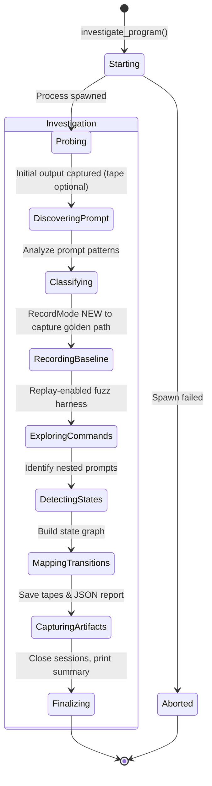
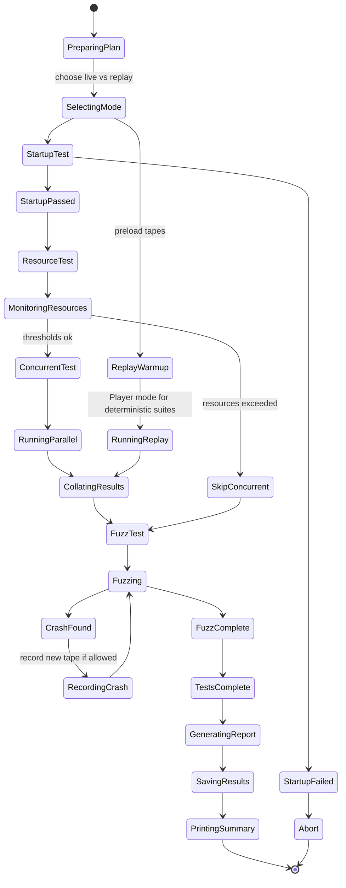
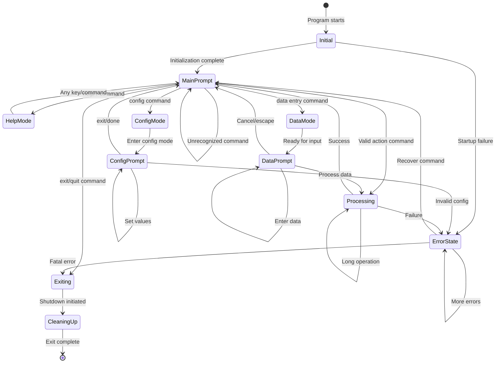

# ClaudeControl State Machine Diagrams

The following state machines capture the complete control flow of ClaudeControl after adding Talkback-style record & replay
capabilities while preserving the original investigation, testing, and automation behaviors. They show how the new replay
package (tapes, matchers, decorators, latency/error injection, summaries) integrates seamlessly with the existing session
management stack built on `pexpect`.

---

## 1. Session Lifecycle State Machine (Live & Replay)
**Context:** Manages the lifecycle of a `Session` from construction through shutdown, covering both live subprocess control and
replay-mode transport selection.
**State Storage:** Session object (in-memory), TapeStore cache on disk, and summary accounting in `~/.claude-control/sessions/`.

### Key Additions
- **LoadingTapes**: Loads JSON5 tapes via `TapeStore`, validates schema, applies normalization/redaction defaults.
- **SelectingTransport**: Chooses between live `pexpect` transport and replay `Player` based on Record/Fallback modes.
- **ReplayPrimed / StreamingReplay**: Model deterministic playback with latency/error injection policies.
- **RecorderArmed / RecorderFlush**: Capture exchanges through `Recorder` with decorators, redaction, and name generation.
- **PrintingSummary**: Emits exit summary of new and unused tapes when enabled.

### Transition Guards
- `SelectingTransport → ReplayPrimed`: Tape match found by matchers after normalization and decorators.
- `SelectingTransport → LiveSpawning`: No tape match or proxy mode selected.
- `Active → StreamingReplay`: Player still streaming recorded chunks with pacing.
- `Dead → RecorderFlush`: RecordMode allows writing tapes.
- `Closing → PrintingSummary`: `summary=True` and TapeStore has accounting events.

### Transition Actions
- `Initializing → LoadingConfig`: Load config and CLI flags, seed RNG for deterministic latency/error injection.
- `LoadingTapes → SelectingTransport`: Build TapeIndex with match keys and mark tapes unused.
- `SelectingTransport → ReplayPrimed`: Prepare Player buffer, resolve latency/error policies.
- `LiveSpawning → RecorderArmed`: Attach `Recorder` via `logfile_read`, start exchange timer.
- `RecorderFlush → Closing`: Serialize exchanges to JSON5, apply tape decorators, acquire file lock, write via `TapeStore`.
- `PrintingSummary → Closed`: Render exit summary listing new/unused tapes.

### Timeout Behaviors
- **Waiting**: Configurable `expect` timeout (default 30s) with recorder capturing TIMEOUT output.
- **StreamingReplay**: Latency policies enforce pacing; global timeout aborts playback if Player stalls.
- **Suspended**: Session inactivity timeout (default 300s).

### Concurrency Control
- TapeStore read/write locks, Recorder exchange lock, session-level mutex around transport operations.

---

## 2. Recorder Exchange State Machine
**Context:** Tracks how the Recorder segments live I/O into exchanges and persists tapes according to RecordMode.
**State Storage:** Recorder buffer (memory), TapeStore staging area on disk.

### Guards & Policies
- `PreparingExchange → CapturingOutput`: Recorder armed and TIMEOUT guard registered.
- `CapturingOutput → Finalizing`: Prompt pattern matched via detectors or expect() completion.
- `Finalizing → Redacting`: Secret detectors trigger (passwords, tokens, keys).
- `Decorating → Persisting`: RecordMode in {NEW, OVERWRITE} and TapeNameGenerator resolved.

### Actions
- `PreparingExchange`: Snapshot pre-state (prompt signature, env hash).
- `CapturingOutput`: Buffer chunk with timestamps, encode as base64 when non-text.
- `Redacting`: Apply redact rules unless `CLAUDECONTROL_REDACT=0`.
- `Decorating`: Run input/output/tape decorators.
- `Persisting`: Acquire portalocker lock, dump JSON5 via pyjson5.

---

## 3. Replay Player State Machine
**Context:** Controls tape playback, matcher resolution, latency/error injection, and fallback to live execution.
**State Storage:** Player buffer, TapeStore usage ledger, optional live transport when proxying.

### Guards & Actions
- `MatchingExchange → StreamingChunks`: Matchers (command, env, prompt, stdin, state hash) succeed after normalization.
- `StreamingChunks → InjectingLatency`: Latency policy returns >0 delay.
- `StreamingChunks → InjectingError`: Error policy hits probabilistic threshold.
- `ProxyLive → MatchingExchange`: Live subprocess output captured to Recorder when RecordMode permits NEW/OVERWRITE.
- `AwaitingNextInput → Completed`: Recorded exit metadata applied to session termination.

### Error Handling
- `Missed → Failing`: Raises `TapeMissError` with diff summary for debugging.
- `InjectingError → Failing`: Synthesizes failures (truncate output, raise signal) for resilience testing.

---

## 4. Tape Store & Summary State Machine
**Context:** Oversees tape discovery, indexing, usage accounting, and exit summary reporting.
**State Storage:** TapeStore in-memory index, filesystem tape directory, summary tracker.

### Actions
- `Scanning`: Walk tape directory recursively once at startup.
- `Validating`: Parse JSON5, apply normalization previews, run fastjsonschema if available.
- `Indexing`: Build normalized keys, register decorators, seed RNG for deterministic ordering.
- `MarkingUsed`: Flag tape/exchange as used for summary and optional eviction heuristics.
- `MarkingNew`: Cache pending writes, commit atomically, refresh index lazily.
- `Summarizing`: Emit new vs unused tape report.

---

## 5. Program Investigation State Machine
**Context:** Tracks discovery progress for unknown CLI programs. Updated to note replay hooks for deterministic automation.
**State Storage:** InvestigationReport object with persisted JSON snapshots and optional tapes for reproducibility.

### Notable Behaviors
- Baseline discoveries can be replayed deterministically to compare future runs.
- Tape summary output highlights unused explorations to revisit.
- Investigation artifacts include both report JSON and tapes.

---

## 6. Black Box Test Execution State Machine
**Context:** Orchestrates automated testing of discovered CLIs with optional replay for deterministic CI.
**State Storage:** TestPlan, TapeStore references, result ledger.

### Replay Integrations
- `SelectingMode`: Chooses Record/Replay settings per test run.
- `ReplayWarmup`: Loads required tapes upfront; fails fast if missing in strict CI.
- `RecordingCrash`: Ensures reproducible crash tapes for debugging.
- `PrintingSummary`: Emits tape summary alongside test report.

---

## 7. Discovered CLI Program State Machine
**Context:** Represents the inferred state model of an investigated CLI program. Unchanged structurally, but tapes can document
transitions for regression checks.
**State Storage:** ProgramState objects within InvestigationReport plus optional tape references per edge.

### Tape Annotations
- Each transition can point to a tape exchange capturing expected prompts and outputs.
- Replay ensures consistent prompts for regression and automation scripts.

---

## Summary

These state machines integrate ClaudeControl’s legacy capabilities with the new replay subsystem:

1. **Session Lifecycle** now branches into live or replay transports, handles recorder flushes, and prints exit summaries.
2. **Recorder**, **Player**, and **TapeStore** state machines model tape creation, deterministic playback, and accounting.
3. **Program Investigation** and **Black Box Testing** leverage tapes for reproducible exploration, fuzzing, and CI runs.
4. **Discovered CLI Program** models remain, now augmented by tape references for regression safety.

Together they describe how ClaudeControl deterministically manages CLI processes across Discover, Test, Automate, and the new
Record/Replay workflows.
