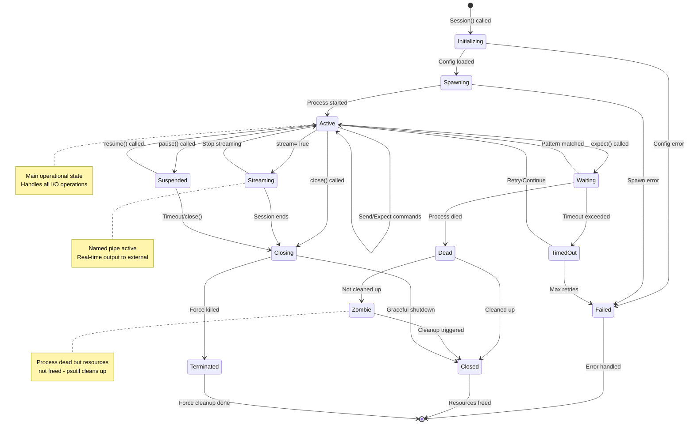
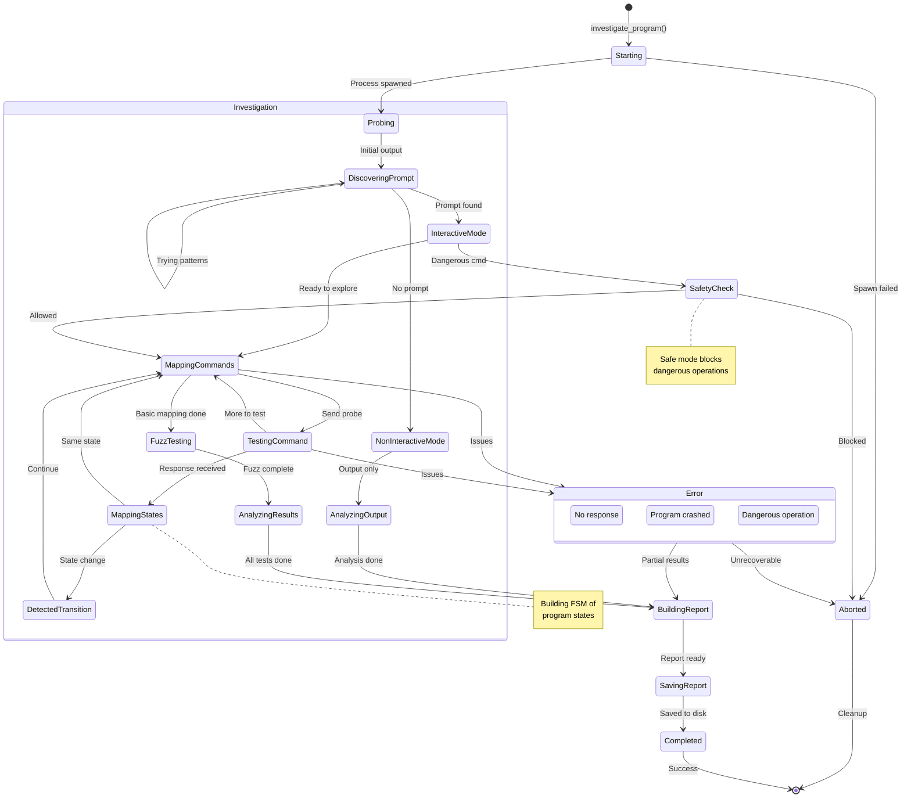
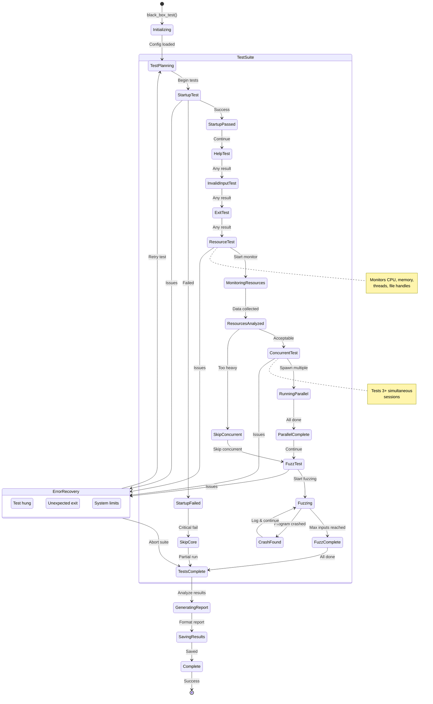
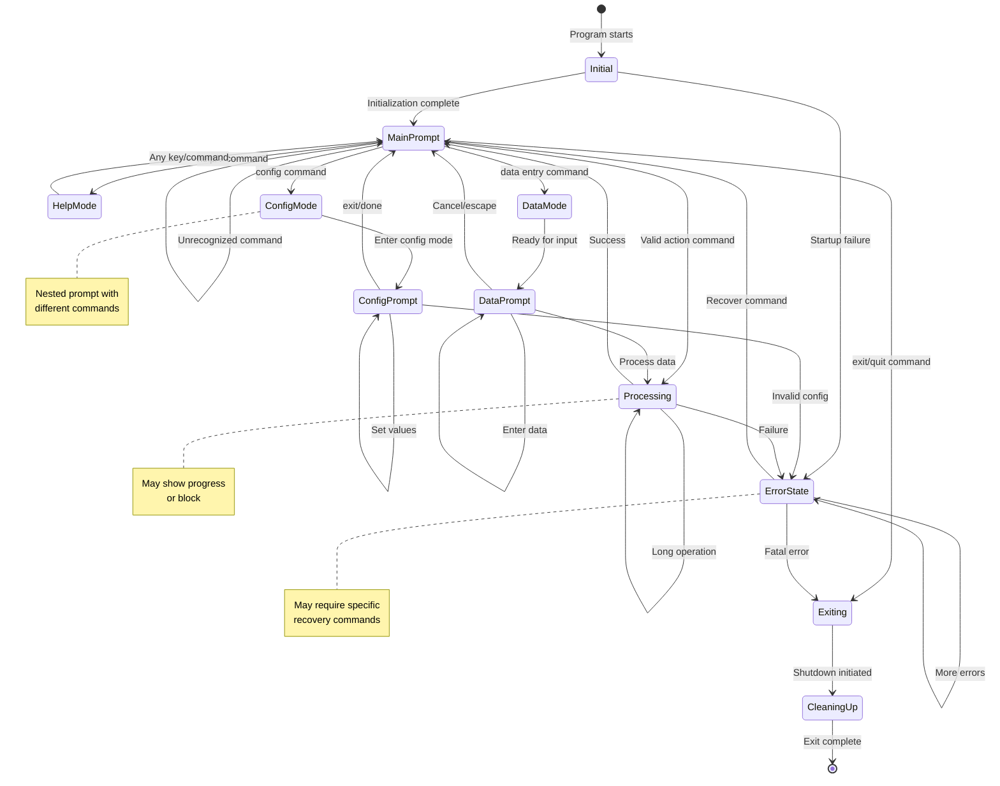

# ClaudeControl State Machine Diagrams

## 1. Session Lifecycle State Machine
**Context:** Manages the complete lifecycle of a CLI process control session
**State Storage:** In-memory (Session object) + file system logs (~/.claude-control/sessions/)

### States
- **Initializing**: Setting up session configuration and directories
- **Spawning**: Creating the subprocess with pexpect
- **Active**: Process running and responsive to commands
- **Waiting**: Blocked on expect() waiting for pattern
- **TimedOut**: Pattern not found within timeout period
- **Streaming**: Actively streaming output to named pipe
- **Suspended**: Process paused but not terminated
- **Dead**: Process has exited but session exists
- **Zombie**: Dead process not yet cleaned up
- **Closing**: Graceful shutdown in progress
- **Closed**: All resources freed, session complete
- **Failed**: Unrecoverable error occurred
- **Terminated**: Force-killed due to timeout or error

### Transition Guards
- `Spawning → Active`: Process PID exists and responding
- `Active → Waiting`: Valid pattern provided to expect()
- `Waiting → TimedOut`: Time > timeout value
- `Active → Streaming`: Named pipe successfully created
- `Dead → Zombie`: auto_cleanup = False
- `Zombie → Closed`: Cleanup interval reached

### Transition Actions
- `Initializing → Spawning`: Create session directory, initialize buffers
- `Spawning → Active`: Register in global registry, start logging
- `Active → Waiting`: Set timeout timer, monitor output buffer
- `Waiting → TimedOut`: Capture recent output for error message
- `Active → Streaming`: Create named pipe, start writer thread
- `* → Dead`: Log exit status, capture final output
- `Dead → Zombie`: Mark for cleanup, notify registry
- `Closing → Closed`: Flush logs, remove from registry, delete pipe
- `* → Failed`: Log error, attempt resource cleanup

### Timeout Behaviors
- **Waiting state**: Configurable timeout (default 30s)
- **Suspended state**: Session timeout (default 300s)
- **Zombie state**: Cleanup interval (60s)

### Concurrency Control
- Thread-safe state transitions via session lock
- Registry lock for state changes affecting global registry
- Atomic state updates with logging

---

## 2. Program Investigation State Machine
**Context:** Tracks investigation progress when discovering unknown CLI programs
**State Storage:** InvestigationReport object + JSON file persistence

### States
- **Starting**: Initializing investigation framework
- **Probing**: Sending initial commands to understand program
- **DiscoveringPrompt**: Detecting interactive prompt patterns
- **InteractiveMode**: Program is interactive, can send commands
- **NonInteractiveMode**: Program is output-only or batch mode
- **MappingCommands**: Discovering available commands
- **TestingCommand**: Executing a specific probe command
- **MappingStates**: Building state transition map
- **DetectedTransition**: Found state change trigger
- **FuzzTesting**: Sending random inputs for edge cases
- **AnalyzingResults**: Processing all gathered data
- **BuildingReport**: Creating structured report
- **SavingReport**: Writing to file system
- **SafetyCheck**: Evaluating command safety
- **Completed**: Investigation successful
- **Aborted**: Investigation failed or stopped

### Transition Guards
- `DiscoveringPrompt → InteractiveMode`: Prompt pattern matched
- `DiscoveringPrompt → NonInteractiveMode`: Timeout without prompt
- `MappingCommands → FuzzTesting`: Min commands discovered (5+)
- `SafetyCheck → Aborted`: Command matches danger patterns
- `Error → BuildingReport`: Partial results available

### Transition Actions
- `Starting → Probing`: Spawn target process, initialize report
- `DiscoveringPrompt → InteractiveMode`: Store prompt pattern
- `TestingCommand → MappingStates`: Log command-response pair
- `DetectedTransition → MappingCommands`: Update state graph
- `FuzzTesting → AnalyzingResults`: Classify fuzz findings
- `BuildingReport → SavingReport`: Generate JSON, create summary
- `SafetyCheck → Aborted`: Log blocked command, cleanup

---

## 3. Black Box Test Execution State Machine
**Context:** Manages the lifecycle of a comprehensive black box test suite
**State Storage:** BlackBoxTester object + test report JSON

### States
- **Initializing**: Setting up test framework
- **TestPlanning**: Determining which tests to run
- **StartupTest**: Testing if program starts correctly
- **HelpTest**: Discovering help system
- **InvalidInputTest**: Testing error handling
- **ExitTest**: Testing shutdown behavior
- **ResourceTest**: Monitoring resource usage
- **MonitoringResources**: Active resource collection
- **ConcurrentTest**: Testing multiple instances
- **RunningParallel**: Multiple sessions active
- **FuzzTest**: Random input testing
- **Fuzzing**: Active fuzz testing
- **TestsComplete**: All tests finished
- **GeneratingReport**: Creating test report
- **Complete**: Test suite done

### Transition Guards
- `StartupFailed → SkipCore`: Exit code != 0 or no output
- `ResourcesAnalyzed → SkipConcurrent`: Memory > 500MB or CPU > 80%
- `Fuzzing → FuzzComplete`: Input count >= max_inputs
- `ErrorRecovery → TestPlanning`: Retry count < 3

### Transition Actions
- `StartupTest → StartupPassed`: Log startup time, initial output
- `ResourceTest → MonitoringResources`: Start psutil monitoring
- `ConcurrentTest → RunningParallel`: Spawn N sessions
- `FuzzTest → Fuzzing`: Generate random inputs
- `CrashFound → Fuzzing`: Save crash input, restart process
- `TestsComplete → GeneratingReport`: Aggregate all test results
- `GeneratingReport → SavingResults`: Write JSON report

---

## 4. CLI Program State Machine (Discovered)
**Context:** Represents the discovered state model of an investigated CLI program
**State Storage:** ProgramState objects within InvestigationReport

### States (Discovered Program)
- **Initial**: Program starting up
- **MainPrompt**: Primary command prompt
- **HelpMode**: Displaying help information
- **ConfigMode**: Configuration submenu
- **ConfigPrompt**: Nested config prompt
- **DataMode**: Data entry mode
- **DataPrompt**: Waiting for data input
- **Processing**: Executing command
- **ErrorState**: Error condition active
- **Exiting**: Shutdown in progress
- **CleaningUp**: Final cleanup

### Discovered Transitions
- `MainPrompt → HelpMode`: Commands: "help", "?", "h"
- `MainPrompt → ConfigMode`: Commands: "config", "setup", "set"
- `MainPrompt → DataMode`: Commands: "add", "insert", "data"
- `MainPrompt → Processing`: Any valid action command
- `ConfigPrompt → MainPrompt`: Commands: "exit", "done", "back"
- `ErrorState → MainPrompt`: Commands: "reset", "clear", "recover"

### Observed Behaviors
- **Prompt Changes**: Different prompts indicate state
- **Command Availability**: Some commands only work in specific states
- **State Persistence**: Some states maintain context
- **Timeout Behaviors**: Some states auto-return to main

---

## Summary

These state machines document ClaudeControl's most complex state management:

1. **Session Lifecycle** - 13 states managing process control from spawn to cleanup
2. **Program Investigation** - 15+ states for systematic program discovery
3. **Black Box Test Execution** - 14 states for comprehensive test orchestration
4. **Discovered CLI Program** - Generic model of investigated program states

Each state machine shows:
- Non-linear, complex transitions with multiple paths
- Guards and conditions controlling transitions
- Actions triggered by state changes
- Error states and recovery mechanisms
- Concurrent and nested state handling

These models are essential for understanding:
- How sessions manage process lifecycle and recovery
- How investigations systematically discover program behavior
- How testing proceeds through comprehensive test suites
- How discovered programs typically organize their states

The state machines reveal the sophisticated control flow that enables ClaudeControl to reliably manage CLI processes across all three core capabilities: Discover, Test, and Automate.